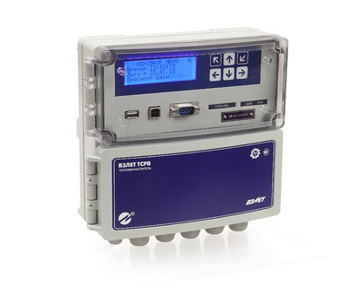

Теплосчетчик-регистратор с резервным питанием и USB-интерфейсом. Универсальное решение для абонентского учета и учета на источниках тепловой энергии.

Комплектуется на базе тепловычислителя ВЗЛЕТ ТСРВ (включен в Государственный реестр средств измерений за №27010-13).

===

<h3>Функциональные возможности:</h3>
<ul class="dash">
<li>подключение до 4-х расходомеров в одной теплосистеме;</li>
<li>раздельное накопление данных по системе отопления и горячего водоснабжения (ГВС) в рамках одной теплосистемы;</li>
<li>архивация всех интегральных счетчиков нарастающим итогом;</li>
<li>наличие журнала изменения контрольной суммы базы (КСБ), нестираемого журнала режимов (электронная пломба), журнала отказов, журнала нештатных ситуаций;</li>
<li>упрощенная настройка с возможностью установки шаблонов наиболее часто применяемых схем;</li>
<li>резервное питание вычислителя от встроенной батареи;</li>
<li>обработка сигнала «реверс».</li>
</ul>
<h3>Отличительные особенности:</h3>
<ul class="dash">
<li>две независимые теплосистемы с 2-мя раздельными архивами (единый архив для зимнего и летнего периодов);</li>
<li>раздельный учет в рамках одной теплосистемы тепловой энергии и параметров ГВС;</li>
<li>измерение и архивация параметров холодной воды и температуры наружного воздуха;</li>
<li>возможность подключения электросчетчика с частотным выходом;</li>
<li>возможность настройки функции «сигнализация»;</li>
<li>наличие USB-интерфейсов на лицевой панели для работы с компьютером и снятия архивов при помощи флэш-накопителя;</li>
<li>удобство монтажа и замены батареи резервного питания;</li>
<li>возможность контроля сигнала «пустая труба» от всех подключенных расходомеров с фиксацией НС в архивах и регистрации времени нештатной ситуации;</li>
<li>черно-белый четырехстрочный индикатор с высокой контрастностью;</li>
<li>работа с программой «Конфигуратор базы» позволяющей быстро и просто настроить прибор;</li>
<li>контроль состояния расходомеров по интерфейсу RS-485 (номер прибора и контрольная сумма).</li>
</ul>
<h3>Вывод информации:</h3>
<ul class="dash">
<li>на жидкокристаллический четырехстрочный индикатор;</li>
<li>по последовательному интерфейсу RS-232/RS-485, USB-Slave, USB-Master .</li>
</ul>

<h3>Характеристики</h3>

<table class="table">
<tbody>
<tr><th>Характеристика</th><th>Значение</th></tr>
<tr>
<td>Количество каналов измерения:   - расхода  - температура  - давление</td>
<td>  до 6  до 6  до 4</td>
</tr>
<tr>
<td>Количество контролируемых теплосистем</td>
<td>2</td>
</tr>
<tr>
<td>Диаметр условного прохода, Dу, мм</td>
<td>от 10 до 5 000</td>
</tr>
<tr>
<td>Диапазон измерения среднего объемного расхода, м³/ч</td>
<td>от 0,01 до 1 000 000</td>
</tr>
<tr>
<td>Диапазон измерения температуры, °С</td>
<td>от минус 50 до 180</td>
</tr>
<tr>
<td>Измерение давления, Мпа</td>
<td>от 0 до 2,5</td>
</tr>
<tr>
<td>Относительная погрешность измерения количества тепла, %</td>
<td>не более ± 5</td>
</tr>
<tr>
<td>Длина линии связи между тепловычислителем и первичными преобразователями, м</td>
<td>до 300</td>
</tr>
<tr>
<td>Глубина архивов измерительной информации, записей:  - часового  - суточного  - месячного</td>
<td>  1440  366  60(5 лет)</td>
</tr>
<tr>
<td>Степень защиты</td>
<td>IP54</td>
</tr>
<tr>
<td>Напряжение питания, В</td>
<td>=24</td>
</tr>
<tr>
<td>Мощность потребления не более, Вт</td>
<td>не более 2</td>
</tr>
<tr>
<td>Средняя наработка на отказ, ч</td>
<td>75000</td>
</tr>
<tr>
<td>Средний срок службы, лет</td>
<td>12</td>
</tr>
<tr>
<td>Гарантийный срок эксплуатации тепловычислителя, лет</td>
<td>6</td>
</tr>
<tr>
<td>Масса тепловычислителя, кг</td>
<td>не более 3</td>
</tr>
<tr>
<td>Габаритные размеры тепловычислителя, мм</td>
<td>215×205×85</td>
</tr>
<tr>
<td>Способ крепления</td>
<td>на DIN-рейку</td>
</tr>
</tbody>
</table>