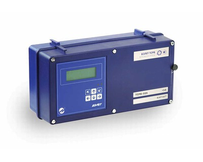

Теплосчетчик-регистратор  для решения задач источников теплоты, а также для любых задач абонентского учета.

Предназначен для измерения, индикации, регистрации параметров теплоносителя и тепловой энергии в теплосистемах различного типа, конфигурации и назначения, а также других вспомогательных параметров на узлах учета.

===

Теплосчетчик-регистратор ВЗЛЕТ ТСР-М исполнений ТСР-025 комплектуется на базе тепловычислителя ВЗЛЕТ ТСРВ (включен в Государственный реестр средств измерений за № 27010-04):
ТСРВ-025 — обеспечение учета в одной теплосистеме при общем количестве трубопроводов до 6-ти, автореверс, электропитание =24В.

<h3>Функциональные возможности:</h3>
<ul class="dash">
<li>вычисление количества тепловой энергии и сохранение значений в архивах;</li>
<li>использование до 6 трубопроводов в одной теплосистеме;</li>
<li>задание автоматической реакции на 33 нештатных ситуации и фиксация до 36 видов отказов датчиков;</li>
<li>автоматический переход между алгоритмами учета по условию и входному сигналу автореверса;</li>
<li>архивирование параметров (тепло, масса, объем, время наработки) нарастающим итогом;</li>
<li>поддержка расходомеров с токовым выходом на трубопроводах с перегретым или насыщенным паром (для источников теплоты);</li>
<li>измерение температуры и давления холодной воды и температуры наружного воздуха;</li>
<li>использование в расчетах разных значений температуры холодной воды для отопительного и межотопительного сезонов;</li>
<li>регистрация в журналах действий пользователя, нештатных ситуаций, отказов и режимов работы.</li>
</ul>
<h3>Отличительные особенности</h3>
<ul class="dash">
<li>раздельный учет в рамках одной теплосистемы тепловой энергии и параметров горячего водоснабжения (ГВС);</li>
<li>раздельная обработка отказов датчиков в системе отопления и в системе ГВС;</li>
<li>отдельные архивы по системе отопления и системе ГВС;</li>
<li>наличие в памяти 22-х наиболее часто применяемых типовых схем теплоучета и алгоритмов расчета;</li>
<li>наличие пользовательской схемы для реализации гибких алгоритмов учета;</li>
<li>наличие многоуровневой защиты от несанкционированного доступа;</li>
<li>наличие контрольной суммы настроечной базы данных прибора, ведение архива изменения контрольной суммы в отдельном журнале;</li>
<li>возможность выбора упрощенной схемы меню прибора;</li>
<li>наглядная настройка тепловычислителя компьютерной программой «Конфигуратор базы» в полноэкранном режиме;</li>
<li>наличие программы «Конвертер базы» для легкого перехода от проектов ТСРВ-024М к ТСРВ-025.</li>
</ul>
<h3>Вывод информации:</h3>
<ul class="dash">
<li>на жидкокристаллический индикатор;</li>
<li>по последовательному интерфейсу RS-232 / RS-485;</li>
<li>по интерфейсу Ethernet (по заказу);</li>
<li>в виде импульсной последовательности или логических сигналов (по заказу);</li>
<li>в виде токового выхода (по заказу).</li>
</ul>

 

<table class="pTable">
<tbody>
<tr><th>Характеристика</th><th>Значение</th></tr>
<tr>
<td rowspan="1" colspan="1">Количество каналов измерения:</td>
<td rowspan="1" colspan="1">&nbsp;</td>
</tr>
<tr>
<td rowspan="1" colspan="1">&nbsp; &nbsp; &nbsp;- расхода</td>
<td rowspan="1" colspan="1">до 6</td>
</tr>
<tr>
<td rowspan="1" colspan="1">&nbsp; &nbsp; &nbsp;- температуры</td>
<td rowspan="1" colspan="1">до 6</td>
</tr>
<tr>
<td rowspan="1" colspan="1">&nbsp; &nbsp; &nbsp;- давления</td>
<td rowspan="1" colspan="1">до 6</td>
</tr>
<tr>
<td>Количество контролируемых теплосистем</td>
<td>1</td>
</tr>
<tr>
<td rowspan="1" colspan="1">Количество входов подключения сигнала направления потока (автореверса)</td>
<td rowspan="1" colspan="1">1</td>
</tr>
<tr>
<td>Номинальный диаметр, DN</td>
<td>от 10 до 5 000</td>
</tr>
<tr>
<td>Диапазон измерения среднего объемного расхода, м3/ч</td>
<td>от 0,01 до 1 000 000</td>
</tr>
<tr>
<td>Диапазон измерения температуры, 0C</td>
<td>от минус 50 до 180 (регистрация до 600)</td>
</tr>
<tr>
<td rowspan="1" colspan="1">Диапазон измерения давления, МПа</td>
<td rowspan="1" colspan="1">от 0,1 до 2,5</td>
</tr>
<tr>
<td>Относительная погрешность измерения количества тепла, %</td>
<td>не более ±5,0</td>
</tr>
<tr>
<td>Температура окружающей среды для тепловычислителя, 0C</td>
<td>от 5 до 50</td>
</tr>
<tr>
<td>Длина линии связи между тепловычислителем и первичными преобразователями, м</td>
<td>до 300</td>
</tr>
<tr>
<td rowspan="1" colspan="1">Глубина архивов измерительной информации, записей:</td>
<td rowspan="1" colspan="1">&nbsp;</td>
</tr>
<tr>
<td rowspan="1" colspan="1">&nbsp; &nbsp; &nbsp;- часового</td>
<td rowspan="1" colspan="1">1488&nbsp;(62 суток)</td>
</tr>
<tr>
<td rowspan="1" colspan="1">&nbsp; &nbsp; &nbsp;- суточного</td>
<td rowspan="1" colspan="1">366</td>
</tr>
<tr>
<td rowspan="1" colspan="1">&nbsp; &nbsp; &nbsp;- месячного</td>
<td rowspan="1" colspan="1">96 (8 лет)</td>
</tr>
<tr>
<td>Степень защиты</td>
<td>IP54</td>
</tr>
<tr>
<td rowspan="1" colspan="1">Питание тепловычислителя</td>
<td rowspan="1" colspan="1">=24В</td>
</tr>
<tr>
<td rowspan="1" colspan="1">Мощность тепловычислителя, Вт</td>
<td rowspan="1" colspan="1">не более 2,5</td>
</tr>
<tr>
<td>Средняя наработка на отказ, ч.</td>
<td>75 000</td>
</tr>
<tr>
<td>Средний срок службы, лет</td>
<td>12</td>
</tr>
<tr>
<td>Гарантийный срок тепловычислителя, лет</td>
<td>6</td>
</tr>
<tr>
<td>Масса тепловычислителя, кг</td>
<td>не более 3</td>
</tr>
<tr>
<td>Габаритные размеры тепловычислителя, мм</td>
<td>250х135х109</td>
</tr>
<tr>
<td>Способ крепления</td>
<td>на DIN-рейку</td>
</tr>
</tbody>
</table>