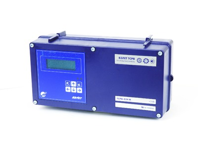

Теплосчетчик-регистратор  для решения задач абонентского учета в многотрубных системах.

Предназначен для измерения, индикации, регистрации параметров теплоносителя и тепловой энергии в теплосистемах различного типа, конфигурации и назначения, а также других вспомогательных параметров на узлах учета.

===

ТСРВ-024М&nbsp;— обеспечение учета в 3-х независимых системах при общем количестве трубопроводов до 9-ти, автореверс, электропитание =24В.

<h3>Функциональные возможности:</h3>
<ul class="dash">
<li>вычисление количества тепловой энергии и сохранение значений в архивах;</li>
<li>учет тепловой энергии в 3-х независимых теплосистемах, содержащих до 4-х трубопроводов;</li>
<li>задание автоматической реакции на 32 нештатных ситуации;</li>
<li>отображение всех текущих результатов измерений и архивных данных на дисплее прибора;</li>
<li>отображение всей текущей измерительной и архивной информации на индикаторе прибора;</li>
<li>отображение зафиксированных нештатных состояний теплосистемы на индикаторе прибора;</li>
<li>регистрация в журналах действий пользователя, нештатных ситуаций, отказов и режимов работы.</li>
</ul>
<h3>Отличительные особенности</h3>
<ul class="dash">
<li>наличие входа сигнала автореверса;</li>
<li>наличие в памяти 11-ти наиболее часто применяемых типовых схем измерительных систем и алгоритмов расчета;</li>
<li>наличие контрольной суммы базы установочных параметров и контрольной суммы настроечной базы данных прибора;</li>
<li>питание расходомеров и датчиков давления от тепловычислителя;</li>
<li>демонтаж прибора для проведения поверки без отключения кабелей связи;</li>
<li>наличие многоуровневой системы защиты от несанкционированного доступа;</li>
<li>наличие программы «Конфигуратор базы», позволяющей быстро и просто настроить тепловычислитель;</li>
<li>наглядная настройка тепловычислителя компьютерной программой «Конфигуратор базы» в полноэкранном режиме.</li>
</ul>
<h3>Вывод информации:</h3>
<ul class="dash">
<li>на жидкокристаллический индикатор;</li>
<li>в виде импульсной последовательности или логических сигналов;</li>
<li>по последовательному интерфейсу RS-232/RS-485;</li>
<li>по интерфейсу Ethernet (по заказу).</li>
</ul>
<h3>Оборудование, рекомендуемое к использованию в составе теплосчетчика ВЗЛЕТ ТСР-М исполнение ТСР-024М:</h3>
<ul class="dash">
<li>расходомеры электромагнитные ВЗЛЕТ ЭР;</li>
<li>расходомеры ультразвуковые ВЗЛЕТ МР (УРСВ-5хх);</li>
<li>термопреобразователи сопротивления ВЗЛЕТ ТПС;</li>
<li>преобразователи давления СДВ производства ЗАО "НПК ВИП".</li>
</ul>

<h3>Характеристики</h3>
<table class="pTable">
<tbody>
<tr><th>Характеристика</th><th>Значение</th></tr>
<tr>
<td style="text-align: left;" rowspan="1" colspan="1">Количество каналов измерения:</td>
<td rowspan="1" colspan="1">&nbsp;</td>
</tr>
<tr>
<td style="text-align: left;" rowspan="1" colspan="1">&nbsp; &nbsp; &nbsp;- расхода</td>
<td rowspan="1" colspan="1">до 9</td>
</tr>
<tr>
<td style="text-align: left;" rowspan="1" colspan="1">&nbsp; &nbsp; &nbsp;- температуры</td>
<td rowspan="1" colspan="1">до 6</td>
</tr>
<tr>
<td style="text-align: left;" rowspan="1" colspan="1">&nbsp; &nbsp; &nbsp;- давления</td>
<td rowspan="1" colspan="1">до 6</td>
</tr>
<tr>
<td>Количество контролируемых теплосистем</td>
<td>до 3</td>
</tr>
<tr>
<td>Номинальный диаметр, DN</td>
<td>от 10 до 5 000</td>
</tr>
<tr>
<td>Диапазон измерения среднего объемного расхода, м3/ч</td>
<td>от 0,01 до 1 000 000</td>
</tr>
<tr>
<td>Диапазон измерения температуры, 0C</td>
<td>от минус 50 до 180</td>
</tr>
<tr>
<td rowspan="1" colspan="1">Диапазон измерения давления, МПа</td>
<td rowspan="1" colspan="1">от 0,1 до 10</td>
</tr>
<tr>
<td>Относительная погрешность измерения количества тепла, %</td>
<td>не более ±5,0</td>
</tr>
<tr>
<td>Температура окружающей среды для тепловычислителя, 0C</td>
<td>от 5 до 50</td>
</tr>
<tr>
<td>Длина линии связи между тепловычислителем и первичными преобразователями, м</td>
<td>до 300</td>
</tr>
<tr>
<td rowspan="1" colspan="1">Глубина архивов измерительной информации, записей:</td>
<td rowspan="1" colspan="1">&nbsp;</td>
</tr>
<tr>
<td rowspan="1" colspan="1">&nbsp; &nbsp; &nbsp;- часового</td>
<td rowspan="1" colspan="1">1488 (62 суток)</td>
</tr>
<tr>
<td rowspan="1" colspan="1">&nbsp; &nbsp; &nbsp;- суточного</td>
<td rowspan="1" colspan="1">366</td>
</tr>
<tr>
<td rowspan="1" colspan="1">&nbsp; &nbsp; &nbsp;- месячного</td>
<td rowspan="1" colspan="1">48</td>
</tr>
<tr>
<td>Степень защиты</td>
<td>IP54</td>
</tr>
<tr>
<td rowspan="1" colspan="1">Питание тепловычислителя</td>
<td rowspan="1" colspan="1">

=24В

</td>
</tr>
<tr>
<td rowspan="1" colspan="1">Мощность потребления тепловычислителя, Вт</td>
<td rowspan="1" colspan="1">не более 2,5</td>
</tr>
<tr>
<td>Средняя наработка на отказ, ч.</td>
<td>75 000</td>
</tr>
<tr>
<td>Средний срок службы, лет</td>
<td>12</td>
</tr>
<tr>
<td>Гарантийный срок тепловычислителя, лет</td>
<td>6</td>
</tr>
<tr>
<td>Масса тепловычислителя, кг</td>
<td>не более 3</td>
</tr>
<tr>
<td>Габаритные размеры тепловычислителя, мм</td>
<td>250х135х98</td>
</tr>
<tr>
<td>Способ крепления</td>
<td>

на DIN-рейку

</td>
</tr>
</tbody>
</table>