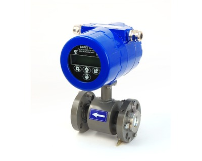

Расходомер-счетчик электромагнитный. Предназначен для точного и стабильного измерения расхода и объема различных жидкостей (агрессивных, пищевых) в технологических процессах промышленных предприятий.

===

### Исполнения по назначению:
* Взлет ТЭР Ох — общепромышленное исполнение;
* Взлет ТЭР Ах — агрессивостойкое исполнение;
* Взлет ТЭР Пх — пищевое исполнение.
* Специсполнение для АЭС.

### Тип присоединения:
* Взлет ТЭР хС — «сэндвич» (DN 10 и DN 15);
* Взлет ТЭР хФ — фланцевое (от DN 20 до DN 300);
* Взлет ТЭР хР — «молочная муфта» (DN 15, DN 32, DN 40, DN 50, DN 80).

### Погрешность измерения:
* ±0,35 % - основная относительная в диапазоне расходов от 0,03×Qv наиб до Qv наиб;
* ±0,35 % - основная приведенная в диапазоне расходов от 0,001×Qv наиб до 0,03×Qv наиб;
* повторяемость результатов измерения — ±0,2 %

### Отличительные особенности:
* расчет массового расхода и массы при введении в прибор значения плотности жидкости;
* высокая точность, стабильность и повторяемость результатов измерения;
* измерение расхода и объема реверсивного потока;
* контроль заполнения трубопровода и электрического сопротивления измеряемой среды;
* режим дозирования;
* использование различных материалов электродов (нержавеющая сталь, титан, тантал);
* возможность монтажа на полимерные трубы без заземляющих колец;
* установочные размеры аналогичны размерам электромагнитных расходомеров ведущих мировых производителей.

### Вывод информации:
* на графический высококонтрастный жидкокристаллический индикатор с постоянной подсветкой;
* в виде импульсов с нормированным весом на два универсальных выхода;
* гальванически развязанный токовый выход 0-5, 0-20, 4-20 мА;
* по последовательному интерфейсу RS-485 (протокол ModBus), протокол Profibus (по заказу), Ethernet (по заказу).

### Технические характеристики:
<table class="table">
<tbody>
<tr><th>Характеристика</th><th colspan="13">Значение</th></tr>
<tr>
<td>Номинальный диаметр, DN</td>
<td style="text-align: right;">10</td>
<td style="text-align: right;">15</td>
<td style="text-align: right;">20</td>
<td style="text-align: right;">25</td>
<td style="text-align: right;">32</td>
<td style="text-align: right;">40</td>
<td style="text-align: right;">50</td>
<td style="text-align: right;">65</td>
<td style="text-align: right;">80</td>
<td style="text-align: right;">100</td>
<td style="text-align: right;">150</td>
<td style="text-align: right;">200</td>
<td style="text-align: right;">300</td>
</tr>
<tr>
<td>Наибольший измеряемый средний объемный расход жидкости, Qv наиб, м3/ч</td>
<td style="text-align: right;">2,83</td>
<td style="text-align: right;">6,37</td>
<td style="text-align: right;">11,32</td>
<td style="text-align: right;">17,69</td>
<td style="text-align: right;">29</td>
<td style="text-align: right;">45</td>
<td style="text-align: right;">71</td>
<td style="text-align: right;">120</td>
<td style="text-align: right;">181</td>
<td style="text-align: right;">283</td>
<td style="text-align: right;">637</td>
<td style="text-align: right;">1132</td>
<td style="text-align: right;">2547</td>
</tr>
<tr>
<td>Давление в трубопроводе, МПа</td>
<td colspan="13">не более 2,5* (4,0 по заказу для фланцованного исполнения)</td>
</tr>
<tr>
<td>Удельная электропроводность жидкости, См/м</td>
<td colspan="13">не менее 10-4</td>
</tr>
<tr>
<td>Диапазон температуры жидкости при футеровке фторопластом, °С&nbsp;</td>
<td colspan="13">от минус 10 до 150</td>
</tr>
<tr>
<td>Диапазон температуры окружающей среды, °С</td>
<td colspan="13">от минус 25 до 70</td>
</tr>
<tr>
<td>Степень защиты</td>
<td colspan="13">IP67</td>
</tr>
<tr>
<td>Напряжение питания, В</td>
<td colspan="13">=24</td>
</tr>
<tr>
<td>Средний срок службы, лет</td>
<td colspan="13">12</td>
</tr>
<tr>
<td>Гарантийный срок эксплуатации, мес.</td>
<td colspan="13">21</td>
</tr>
</tbody>
</table>

<small>* для ВЗЛЕТ ТЭР с "молочной муфтой" 1,6 МПа  </small>

### Массогабаритные характеристики для ВЗЛЕТ ТЭР Ох и ТЭР Ах:
<table class="table">
<tbody>
<tr><th>DN</th><th>10</th><th>15</th><th>20</th><th>25</th><th>32</th><th>40</th><th>50</th><th>65</th><th>80</th><th>100</th><th>150</th><th>200</th><th>300</th></tr>
<tr>
<td>Длина проточной части, мм</td>
<td style="text-align: center;">93</td>
<td style="text-align: center;">93</td>
<td style="text-align: center;">150</td>
<td style="text-align: center;">200</td>
<td style="text-align: center;">200</td>
<td style="text-align: center;">200</td>
<td style="text-align: center;">200</td>
<td style="text-align: center;">200</td>
<td style="text-align: center;">200</td>
<td style="text-align: center;">250</td>
<td style="text-align: center;">270</td>
<td style="text-align: center;">340</td>
<td style="text-align: center;">500</td>
</tr>
<tr>
<td>Высота расходомера, мм</td>
<td style="text-align: center;">240</td>
<td style="text-align: center;">240</td>
<td style="text-align: center;">270</td>
<td style="text-align: center;">280</td>
<td style="text-align: center;">290</td>
<td style="text-align: center;">300</td>
<td style="text-align: center;">315</td>
<td style="text-align: center;">325</td>
<td style="text-align: center;">340</td>
<td style="text-align: center;">370</td>
<td style="text-align: center;">430</td>
<td style="text-align: center;">493</td>
<td style="text-align: center;">607</td>
</tr>
<tr>
<td>Масса (не более), кг</td>
<td style="text-align: center;">3,4</td>
<td style="text-align: center;">3,5</td>
<td style="text-align: center;">5,6</td>
<td style="text-align: center;">6,2</td>
<td style="text-align: center;">7,7</td>
<td style="text-align: center;">8,6</td>
<td style="text-align: center;">10,1</td>
<td style="text-align: center;">11,5</td>
<td style="text-align: center;">13,6</td>
<td style="text-align: center;">19,7</td>
<td style="text-align: center;">33,2</td>
<td style="text-align: center;">52</td>
<td style="text-align: center;">98</td>
</tr>
</tbody>
</table>

### Массогабаритные характеристики для ВЗЛЕТ ТЭР Пх:
<table class="table">
<tbody>
<tr><th>DN</th><th style="text-align: center;">15</th><th style="text-align: center;">32</th><th style="text-align: center;" rowspan="1" colspan="1">40</th><th style="text-align: center;">50</th><th>80</th></tr>
<tr>
<td>Длина проточной части, мм</td>
<td style="text-align: center;">141</td>
<td style="text-align: center;">186</td>
<td style="text-align: center;" rowspan="1" colspan="1">188</td>
<td style="text-align: center;">222</td>
<td style="text-align: center;">262</td>
</tr>
<tr>
<td>Высота расходомера, мм</td>
<td style="text-align: center;">245</td>
<td style="text-align: center;">275</td>
<td style="text-align: center;" rowspan="1" colspan="1">283</td>
<td style="text-align: center;">285</td>
<td style="text-align: center;">320</td>
</tr>
<tr>
<td>Масса (не более), кг</td>
<td style="text-align: center;">3,8</td>
<td style="text-align: center;">7,6</td>
<td style="text-align: center;" rowspan="1" colspan="1">8,1</td>
<td style="text-align: center;">11,0</td>
<td style="text-align: center;">14,5</td>
</tr>
</tbody>
</table>