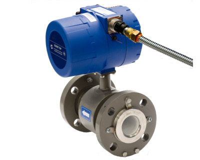

Расходомер-счетчик электромагнитный. Предназначен для точного и стабильного измерения расхода и объема различных жидкостей в затопляемых зонах.

===

### Исполнения по назначению: 
* Взлет ТЭР Ох – общепромышленное исполнение;
* Взлет ТЭР Ах – агрессивостойкое исполнение.

### Тип присоединения:
* Взлет ТЭР хС - «сэндвич» (DN 10 и DN 15)
* Взлет ТЭР хФ - фланцевое(от DN 20 до DN 300)

<h3>Погрешность измерения:</h3>
<ul class="dash">
<li>±0,35 % - основная относительная в диапазоне расходов от 0,03×Qv наиб до Qv наиб;</li>
<li>±0,35 % - основная приведенная в диапазоне расходов от 0,001×Qv наиб до 0,03×Qv наиб;</li>
<li>повторяемость результатов измерения — ±0,2 %</li>
</ul>
<h3>Отличительные особенности:</h3>
<ul class="dash">
<li>без индикации по месту, по заказу комплектуется выносным блоком индикации ИВК-ТЭР;</li>
<li>комплектуется кабелем требуемой длины с установленной ответной частью разъема (по заказу);</li>
<li>интерфейсы: два универсальных выхода, RS-485 (ModBus), выносная кнопка, токовый выход;</li>
<li>подключение на объекте без нарушения герметичности прибора (блок электроники опломбирован на заводе-извотовителе);</li>
<li>высокая точность, стабильность и повторяемость результатов измерения;</li>
<li>измерение расхода и объема реверсивного потока;</li>
<li>контроль заполнения трубопровода и сопротивления измеряемой среды;</li>
<li>использование различных материалов электродов (нержавеющая сталь, титан, тантал);</li>
<li>возможность монтажа на полимерные трубы без заземляющих колец;</li>
<li>установочные размеры аналогичны размерам электромагнитных расходомеров ведущих мировых производителей;</li>
<li>расчет массового расхода и массы при введении в прибор значения плотности контролируемой жидкости.</li>
</ul>