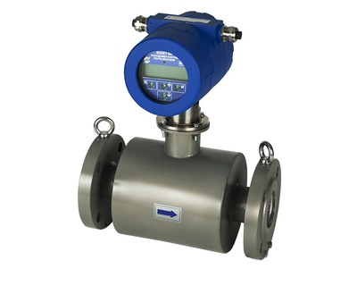

Расходомер-счетчик ультразвуковой.

Универсальное решение для учета расхода различных жидкостей в сложных условиях эксплуатации.

===

Предназначен для измерения среднего объемного расхода и объема реверсивных потоков различных жидкостей (горячей, холодной, кислот, щелочей, пищевых продуктов, нефтепродуктов и т.д.) в одном напорном трубопроводе в сложных условиях эксплуатации, в том числе во взрывоопасных зонах, в металлургии, для оперативного учета нефтепродуктов, химической промышленности и т.д.

<h3>Отличительные особенности:</h3>
<ul>
<li>многолучевая схема зондирования, обеспечивающая точность измерений независимо от профиля потока;</li>
<li>моноблочная конструкция прибора;</li>
<li>значительное улучшение эксплуатационных характеристик за счет применения инновационной электроники и цифровой обработки сигнала;</li>
<li>надежная работа прибора при изменении параметров жидкости;</li>
<li>простота установки и эксплуатации;</li>
<li>измерение объема и расхода реверсивного потока;</li>
<li>измерение без потерь давления в трубопроводе;</li>
<li>наличие режима дозирования объема.</li>
</ul>

<strong>Вывод информации:</strong>

<ul>
<li>на жидкокристаллический индикатор;</li>
<li>в виде импульсов с нормированным весом или логических сигналов;</li>
<li>по последовательному интерфейсу RS-485;</li>
<li>в виде нормированного токового сигнала;</li>
<li>по интерфейсу Ethernet (только для УРСВ-733, по заказу);</li>
<li>по интерфейсу HART (только для УРСВ-733, по заказу).</li>
</ul>

&nbsp;

<h3>Технические характеристики</h3>
<table>
<tbody>
<tr><th>Характеристика</th><th>Значение</th></tr>
<tr>
<td>Относительная погрешность измерения расхода (объема), %, не более</td>
<td>±(0,4+0,075/v)*</td>
</tr>
<tr>
<td>Номинальный диаметр, DN</td>
<td>25÷1000</td>
</tr>
<tr>
<td>Скорость потока, м/с</td>
<td>до 20</td>
</tr>
<tr>
<td>Диапазон температуры жидкости, °С</td>
<td>от минус 30 до 130 (до 160 по заказу)</td>
</tr>
<tr>
<td>Температура окружающей среды, °С</td>
<td>от минус 30 до 50</td>
</tr>
<tr>
<td>Давление в трубопроводе, МПа</td>
<td>2,5 (16 по заказу)</td>
</tr>
<tr>
<td>Степень защиты</td>
<td>IP68</td>
</tr>
<tr>
<td>Маркировка взрывозащиты для УРСВ-733 Ex</td>
<td>1Ex d [ib] IIC T6…T3 Gb X</td>
</tr>
<tr>
<td>Глубина архивов измерительной информации, записей:  - часового  - суточного  - месячного  - интервального  - дозирования</td>
<td>    1440  60  48  14&nbsp;400  512</td>
</tr>
<tr>
<td>Напряжение питания, В</td>
<td>=24</td>
</tr>
<tr>
<td>Потребляемая мощность, Вт</td>
<td>не более 8</td>
</tr>
<tr>
<td>Срок службы, лет</td>
<td>25</td>
</tr>
<tr>
<td>Гарантийный срок эксплуатации, мес.</td>
<td>25</td>
</tr>
</tbody>
</table>

* - v скорость потока м/с

