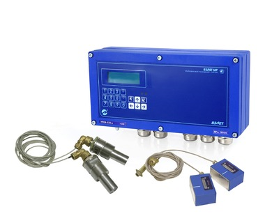

Расходомер-счетчик ультразвуковой.

Предназначен для измерения среднего объемного расхода и объема реверсивных потоков различных жидкостей (горячей, холодной, сточных вод, кислот, щелочей, пищевых продуктов и т.д.) в одном или нескольких напорных трубопроводах при различных условиях эксплуатации, в том числе во взрывоопасных зонах.

===

### Исполнения:
* УРСВ-5x0 ц - многоканальный;
* УРСВ-5xx ц - многолучевой.
* Выпускается специсполнение для АЭС.

<h3>Модификации:</h3>
<table class="pTable" style="width: 100%">
<tbody>
<tr><th rowspan="2">Тип</th><th rowspan="2">Исполнение</th><th colspan="4">Количество измерительных каналов</th><th colspan="4">Количество контролируемых трубопроводов</th><th rowspan="2">Относительная погрешность измерения расхода (объема), %</th></tr>
<tr><th>1</th><th>2</th><th>3</th><th>4</th><th>1</th><th>2</th><th>3</th><th>4</th></tr>
<tr>
<td>Одноканальный</td>
<td>УРСВ-510Ц</td>
<td class="center" style="text-align: center;">+</td>
<td>&nbsp;</td>
<td>&nbsp;</td>
<td>&nbsp;</td>
<td class="center" style="text-align: center;">+</td>
<td>&nbsp;</td>
<td>&nbsp;</td>
<td>&nbsp;</td>
<td class="center" style="text-align: center;" rowspan="4">±(0,95+0,1/v)*</td>
</tr>
<tr>
<td rowspan="3">Многоканальные</td>
<td>УРСВ-520Ц</td>
<td>&nbsp;</td>
<td class="center" style="text-align: center;">+</td>
<td>&nbsp;</td>
<td>&nbsp;</td>
<td>&nbsp;</td>
<td class="center" style="text-align: center;">+</td>
<td>&nbsp;</td>
<td>&nbsp;</td>
</tr>
<tr>
<td>УРСВ-530Ц</td>
<td>&nbsp;</td>
<td>&nbsp;</td>
<td class="center" style="text-align: center;">+</td>
<td>&nbsp;</td>
<td>&nbsp;</td>
<td>&nbsp;</td>
<td class="center" style="text-align: center;">+</td>
<td>&nbsp;</td>
</tr>
<tr>
<td>УРСВ-540Ц</td>
<td>&nbsp;</td>
<td>&nbsp;</td>
<td>&nbsp;</td>
<td class="center" style="text-align: center;">+</td>
<td>&nbsp;</td>
<td>&nbsp;</td>
<td>&nbsp;</td>
<td class="center" style="text-align: center;">+</td>
</tr>
<tr>
<td rowspan="3">Многолучевые</td>
<td>УРСВ-522Ц</td>
<td>&nbsp;</td>
<td class="center" style="text-align: center;">+</td>
<td>&nbsp;</td>
<td>&nbsp;</td>
<td class="center" style="text-align: center;">+</td>
<td>&nbsp;</td>
<td>&nbsp;</td>
<td>&nbsp;</td>
<td class="center" style="text-align: center;" rowspan="2">±(0,45+0,1/ v)*</td>
</tr>
<tr>
<td>УРСВ-542Ц</td>
<td>&nbsp;</td>
<td>&nbsp;</td>
<td>&nbsp;</td>
<td class="center" style="text-align: center;">+</td>
<td class="center">&nbsp;</td>
<td class="center" style="text-align: center;">+</td>
<td>&nbsp;</td>
<td>&nbsp;</td>
</tr>
<tr>
<td>УРСВ-544Ц</td>
<td>&nbsp;</td>
<td>&nbsp;</td>
<td>&nbsp;</td>
<td class="center" style="text-align: center;">+</td>
<td class="center" style="text-align: center;">+</td>
<td>&nbsp;</td>
<td>&nbsp;</td>
<td>&nbsp;</td>
<td class="center" style="text-align: center;">±(0,25+0,1/ v)*</td>
</tr>
</tbody>
</table>

* v - скорость потока, м/с

<h3>Отличительные особенности:</h3>
<ul class="dash">
<li>цифровая обработка сигнала, минимальное время одного измерения, высокая помехозащищенность;</li>
<li>надежная работа прибора при изменении температуры, давления, вязкости и других параметров жидкости;</li>
<li>значительное упрощение пусконаладочных работ (без применения осциллографа);</li>
<li>измерение расхода и объема реверсивного потока;</li>
<li>возможна поставка датчиков различного исполнения (накладные, врезные), а также готовых измерительных участков;</li>
<li>измерение без потерь давления в трубопроводе;</li>
<li>наличие режима дозирования объема.</li>
</ul>
<h3>Вывод информации:</h3>
<ul class="dash">
<li>на жидкокристаллический индикатор;</li>
<li>в виде импульсов с нормированным весом или логических сигналов;</li>
<li>по последовательному интерфейсу RS-232/RS-485;</li>
<li>в виде нормированного токового сигнала (по заказу);</li>
<li>по интерфейсу Ethernet (по заказу).</li>
</ul>

<h3>Технические характеристики</h3>
<table class="pTable">
<tbody>
<tr><th>Характеристика</th><th>Значение</th></tr>
<tr>
<td lang="" dir="" scope="" align="" valign="top">

Номинальный диаметр, DN

</td>
<td>

&nbsp;от 10 до 5 000 (от 150 до 10 000)*

</td>
</tr>
<tr>
<td rowspan="1" colspan="1">Диапазон температуры жидкости, оC</td>
<td rowspan="1" colspan="1">от минус 30 до 160</td>
</tr>
<tr>
<td>Температура окружающей среды для вторичного преобразователя (ВП), оС</td>
<td>от 0 до 50 (от минус 40 до 65)**</td>
</tr>
<tr>
<td>Давление в трубопроводе для врезных преобразователей электроакустических (ПЭА), МПа</td>
<td>не более 2,5***</td>
</tr>
<tr>
<td>Степень защиты ВП/ПЭА</td>
<td>IP54/IP68</td>
</tr>
<tr>
<td>

Глубина архивов измерительной информации, записей:

- часового

- суточного

- месячного

- интервального

- дозирования

</td>
<td>

&nbsp;

1440

60

48

14 400

512

</td>
</tr>
<tr>
<td rowspan="1" colspan="1">Питание</td>
<td rowspan="1" colspan="1">

=24В

</td>
</tr>
<tr>
<td rowspan="1" colspan="1">Потребляемая мощность, Вт</td>
<td rowspan="1" colspan="1">не более 12</td>
</tr>
<tr>
<td>Средняя наработка на отказ, ч.</td>
<td>75 000</td>
</tr>
<tr>
<td>Средний срок службы, лет</td>
<td>12</td>
</tr>
<tr>
<td>Гарантийный срок эксплуатации, мес.</td>
<td>25</td>
</tr>
<tr>
<td>Масса вторичного преобразователя, кг</td>
<td>не более 3</td>
</tr>
<tr>
<td>Габаритные вторичного преобразователя, мм</td>
<td>250х154х75</td>
</tr>
</tbody>
</table>
<address>&nbsp;* для многолучевого исполнения</address><address>** по заказу</address><address>*** до 25 МПа (по заказу)</address>
<h3><small></small>&nbsp;</h3>
