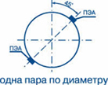
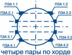

Преобразователи электроакустические для стационарных ультразвуковых расходомеров.

В составе расходомеров могут использоваться ПЭА двух основных типов:

* ПЭА Н-xxx xx — накладные герметичные, устанавливаемые на наружную стенку измерительных участков (ИУ);
* ПЭА В-xxx xx — врезные герметичные, устанавливаемые в отверстия в стенках ИУ.
* Преобразователи электроакустические также выпускаются во взрывозащищенном исполнении (индекс Ех) и исполнении для атомной промышленности (индекс АТ).

===

### Схема установки врезных ПЭА:
    
#### в U-образный измерительный участок:

#### в прямолинейный измерительный участок:
     
 &nbsp;   &nbsp;   &nbsp;  

<h3>Преобразователи электроакустические накладные:</h3>
<table class="pTable">
<tbody>
<tr><th>ПЭА</th><th>Рабочая частота, Мгц</th><th>Диапазон температуры жидкости, °С</th><th>Максимальное давление, МПа</th><th>Габариты, мм</th></tr>
<tr>
<td>H-021, -021 Ex</td>
<td>1,0</td>
<td class="cen" rowspan="2">от минус 30 до 150</td>
<td class="cen" rowspan="3">не ограничено</td>
<td class="cen" rowspan="3">61 х 43 х 31</td>
</tr>
<tr>
<td>H-011</td>
<td class="cen">0,3</td>
</tr>
<tr>
<td>Н-121 АТ</td>
<td class="cen">1,0</td>
<td class="cen">от минус 30 до 170</td>
</tr>
</tbody>
</table>

<h3>Преобразователи электроакустические врезные:</h3>
<table class="pTable">
<tbody>
<tr><th>ПЭА</th><th>Конструктивные особенности</th><th>Максимальное рабочее давление, МПа</th><th>Диапазон температур жидкости, °С</th><th>Степень защиты</th><th>Длина, мм</th><th>Диаметр, мм</th></tr>
<tr>
<td colspan="7"><strong>С титановым протектором</strong></td>
</tr>
<tr>
<td>B-202, -202 Ex</td>
<td>Ввинчиваемый, с угловым кабельным выводом</td>
<td class="cen" style="text-align: center;">2,5</td>
<td class="cen" style="text-align: center;" rowspan="8" valign="middle">от минус 30 до 160</td>
<td class="cen" style="text-align: center;" rowspan="3">IP68</td>
<td class="cen" style="text-align: center;">140</td>
<td class="cen" style="text-align: center;">42</td>
</tr>
<tr>
<td>B-206, -206 Ex</td>
<td>Ввинчиваемый, с угловым кабельным выводом и с увеличенной длинной погружной части</td>
<td class="cen" style="text-align: center;">2,5</td>
<td class="cen" style="text-align: center;">214</td>
<td class="cen" style="text-align: center;">42</td>
</tr>
<tr>
<td>B-204, -204 Ex, -204 АТ</td>
<td>Ввинчиваемый, с угловым кабельным выводом</td>
<td class="cen" style="text-align: center;">16</td>
<td class="cen" style="text-align: center;">144</td>
<td class="cen" style="text-align: center;">42</td>
</tr>
<tr>
<td>В-224, В-224Ех</td>
<td>ПЭА В-224 для применения в контакте с агрессивными средами. ПЭА В-224Ех допустимо применение на АЭС</td>
<td class="cen" style="text-align: center;">16</td>
<td class="cen" style="text-align: center;">IP67</td>
<td class="cen" style="text-align: center;">147</td>
<td class="cen" style="text-align: center;">42</td>
</tr>
<tr>
<td>B-205, -205 Ex</td>
<td>Ввинчиваемый, с угловым кабельным выводом</td>
<td class="cen" style="text-align: center;">25</td>
<td class="cen" style="text-align: center;" rowspan="5">IP68</td>
<td class="cen" style="text-align: center;">143</td>
<td class="cen" style="text-align: center;">42</td>
</tr>
<tr>
<td>В-212</td>
<td>Для применения в контакте с растворами солей и пищевых кислот: уксусной и лимонной</td>
<td class="cen" style="text-align: center;">2,5</td>
<td class="cen" style="text-align: center;">140</td>
<td class="cen" style="text-align: center;">42</td>
</tr>
<tr>
<td>В-213</td>
<td>Для применения в контакте с растворами солей и пищевых кислот: уксусной и лимонной</td>
<td class="cen" style="text-align: center;">16</td>
<td class="cen" style="text-align: center;">140</td>
<td class="cen" style="text-align: center;">42</td>
</tr>
<tr>
<td>В-118, -118 Ех, - 118 АТ</td>
<td>Малогабаритные</td>
<td class="cen" style="text-align: center;">2,5</td>
<td class="cen" style="text-align: center;">55</td>
<td class="cen" style="text-align: center;">24</td>
</tr>
<tr>
<td>В-214</td>
<td>Малогабаритные</td>
<td class="cen" style="text-align: center;">25</td>
<td class="cen" style="text-align: center;" valign="middle">от минус 30 до 70</td>
<td class="cen" style="text-align: center;">47</td>
<td class="cen" style="text-align: center;">30</td>
</tr>
<tr>
<td>В-220</td>
<td>Для установки с помощью КПВД</td>
<td class="cen" style="text-align: center;">2,5</td>
<td class="cen" style="text-align: center;" valign="middle">от минус 30 до 130</td>
<td class="cen" style="text-align: center;">IP65</td>
<td class="cen" style="text-align: center;">77</td>
<td class="cen" style="text-align: center;">42</td>
</tr>
<tr>
<td>В-220 (IP68)</td>
<td>Для установки с помощью КПВД</td>
<td class="cen" style="text-align: center;">2,5</td>
<td class="cen" style="text-align: center;" valign="middle">от минус 30 до 130</td>
<td class="cen" style="text-align: center;">IP68*</td>
<td class="cen" style="text-align: center;">77</td>
<td class="cen" style="text-align: center;">42</td>
</tr>
<tr>
<td colspan="7"><strong>В пластиковом стакане</strong></td>
</tr>
<tr>
<td>B-502, -502 Ex</td>
<td>Ввинчиваемый, с угловым кабельным выводом</td>
<td class="cen" style="text-align: center;">2,5</td>
<td class="cen" style="text-align: center;">от минус 30 до 130</td>
<td class="cen" style="text-align: center;" rowspan="3">IP68</td>
<td class="cen" style="text-align: center;" rowspan="2">144</td>
<td class="cen" style="text-align: center;" rowspan="2">42</td>
</tr>
<tr>
<td>B-504, -504 Ex</td>
<td>Ввинчиваемый, с угловым кабельным выводом</td>
<td class="cen" style="text-align: center;">16</td>
<td class="cen" style="text-align: center;">от минус 30 до 160</td>
</tr>
<tr>
<td>В-018</td>
<td>Малогабаритный</td>
<td class="cen" style="text-align: center;">2,5</td>
<td class="cen" style="text-align: center;">от минус 30 до 130</td>
<td class="cen" style="text-align: center;">50</td>
<td class="cen" style="text-align: center;">31</td>
</tr>
</tbody>
</table>

<small>* кабель связи выводится с защитной металлоплатиковой трубе</small>
