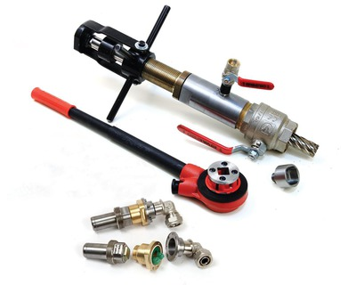

Комплект оборудования для врезки преобразователей электроакустических.

Предназначен для высверливания отверстий в стальном трубопроводе и монтажа (демонтажа) ПЭА в патрубки без опустошения трубопровода. 

===

ВЗЛЕТ КПВД расширяет области применения ультразвуковых расходомеров ВЗЛЕТ МР и позволяет производить измерение расхода даже в том случае, когда нет возможности опустошить водовод на время монтажа врезных ПЭА. ВЗЛЕТ КПВД позволяет производить монтаж ПЭА как по диаметру, так и по двум средне-радиусным хордам. ВЗЛЕТ КПВД применяется для монтажа специальных врезных ультразвуковых датчиков типа ПЭА В-220/220 IP68.

<h3>Технические характеристики:</h3>
<table class="pTable">
<tbody>
<tr><th>Характеристика</th><th>Значение</th></tr>
<tr>
<td>Тип жидкости в трубопроводе</td>
<td>вода</td>
</tr>
<tr>
<td>Максимальная температура жидкости на момент врезки в трубопровод и монтажа/демонтажа ПЭА, °С</td>
<td>+ 40</td>
</tr>
<tr>
<td>Материал трубопровода</td>
<td>сталь</td>
</tr>
<tr>
<td>Максимальное давление в трубопроводе на момент просверливания отверстий и монтажа/демонтажа ПЭА, МПа:</td>
<td>1,6</td>
</tr>
</tbody>
</table>
<h3>Состав комплекта:</h3>
<table class="pTable">
<tbody>
<tr><th>Наименование</th><th>Количество (штук)</th></tr>
<tr>
<td>Устройство для высверливания и монтажа/демонтажа ультразвуковых преобразователей с переходником резьбовым и шаровым краном в кейсе</td>
<td>1</td>
</tr>
<tr>
<td>Сверло корончатое (диаметр 27 мм)</td>
<td>2</td>
</tr>
<tr>
<td>Переходник для сверла корончатого</td>
<td>1</td>
</tr>
<tr>
<td>Переходник магнитный для монтажа/демонтажа ультразвуковых преобразователей</td>
<td>1</td>
</tr>
<tr>
<td>Кран шаровой VT.215-2’’</td>
<td>1</td>
</tr>
<tr>
<td>Ручной привод (трещетка) с переходником для устройства для высверливания</td>
<td>1</td>
</tr>
<tr>
<td>Набор ключей</td>
<td>1</td>
</tr>
</tbody>
</table>
