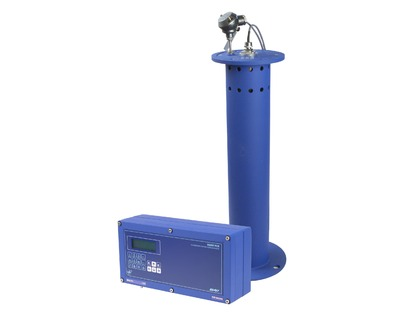

Расходомер-счетчик ультразвуковой для безнапорных трубопроводов и открытых каналов.

Предназначен для автоматического бесконтактного измерения объемного расхода, объема, уровня различных жидкостей с широким спектром свойств (включая агрессивные) в безнапорных трубопроводах и открытых каналах (U-образных лотках, стандартных водосливах и лотках, а также открытых каналах произвольной формы).

===

Может применяться в технологических процессах промышленных предприятий, на очистных сооружениях, в канализационных сетях, системах экологического мониторинга и предупреждения о стихийных бедствиях, АСУ ТП и т.д.

<h3>Исполнения:</h3>

<strong>РСЛ-212</strong> - может комплектоваться акустическими системами разного конструктивного исполнения с коррекцией скорости звука с использованием термометра или реперного отражателя. Это обеспечивает устойчивую работу прибора при различном составе газовой среды (пары нефтепродуктов, кислот, щелочей и т.д.). Акустические системы для РСЛ-212 выпускаются в общепромышленном, агрессивостойком и бензомаслостойком исполнениях.

<strong>РСЛ-222</strong> - комплектуется компактной акустической системой с малой мертвой зоной (250 мм) на основе раздельно-совмещенного ультразвукового датчика с интегрированным термометром. Такая акустическая система может устанавливаться на трубопроводы диаметром от 100 мм с использованием стандартных пластиковых элементов канализационных трубопроводов, в том числе в составе узлов домового учета сточных вод.

<h3>Отличительные особенности:</h3>
<ul class="dash">­
<li>высокая точность измерения уровня за счет применения эффективных цифровых методов обработки сигнала;</li>
­
<li>помехозащищенность измерительного тракта, позволяющее использовать прибор в непосредственной близости от насосов, электродвигателей и других источников мощных промышленных помех;</li>
­
<li>автоматический учет изменения скорости звука в газовой среде;</li>
­
<li>периодическая самоочистка ультразвукового датчика от конденсата;</li>
­
<li>расчет &nbsp;ли загрузка в прибор расходной характеристики трубопровода (лотка) непосредственно на объекте с помощью специализированного ПО;</li>
­
<li>возможность размещения измерительного блока на расстоянии до 250 м от объекта.</li>
</ul>
<h3>Вывод информации:</h3>
<ul class="dash">
<li>на жидкокристаллический индикатор;</li>
<li>в виде частотных и/или импульсных сигналов (по заказу);</li>
<li>в виде нормированного токового сигнала (по заказу);</li>
<li>по интерфейсу Ethernet (по заказу);</li>
<li>по последовательному интерфейсу RS-232/RS-485;</li>
<li>в виде срабатывания логических выходов (по заказу).</li>
</ul>

<h3>Технические характеристики</h3>
<table class="pTable">
<tbody>
<tr><th>Характеристика</th><th>Значение</th></tr>
<tr>
<td lang="" dir="" scope="" align="" valign="top">

Внутренний диаметр безнапорных трубопроводов и U-образных лотков, мм

</td>
<td>

от 100

</td>
</tr>
<tr>
<td>Относительная погрешность измерения объемного расхода и объема, не более</td>
<td>±5,0 %</td>
</tr>
<tr>
<td rowspan="1" colspan="1">

Максимальная измеряемая дистанция, м

</td>
<td rowspan="1" colspan="1">

не менее 12

</td>
</tr>
<tr>
<td>Максимальная длина&nbsp;соединительного кабеля акустичских систем, м</td>
<td>250</td>
</tr>
<tr>
<td rowspan="1" colspan="1">Номинальное напряжение питания, В</td>
<td rowspan="1" colspan="1">=24</td>
</tr>
<tr>
<td rowspan="1" colspan="1">Потребляемая мощность, Вт</td>
<td rowspan="1" colspan="1">не более 20</td>
</tr>
<tr>
<td rowspan="1" colspan="1">Гарантийные срок эксплуатации, мес.</td>
<td rowspan="1" colspan="1">21</td>
</tr>
</tbody>
</table>
