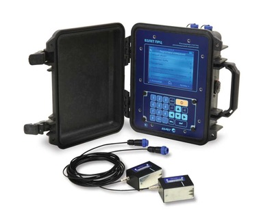

Расходомер-счетчик ультразвуковой переносной.

Оптимальный выбор для оперативного контроля «технологических» и «коммерческих» трубопроводов, а также для задач энергоаудита.

===

Новое цифровое поколение портативных приборов для оперативного измерения расхода и объема акустически прозрачных жидкостей с помощью накладных датчиков без вскрытия трубопровода. Измерение возможно в напорных металлических и пластмассовых, в т.ч. многослойных трубопроводах, в различных условиях эксплуатации, а также во взрывоопасных зонах.

<h3>Отличительные особенности:</h3>
<ul class="dash">
<li>цифровая обработка сигнала, минимальное время одного измерения, высокая помехозащищенность;</li>
<li>автоматическая настройка;</li>
<li>выполнение измерений реверсивного потока жидкости в трубопроводе;</li>
<li>возможна поставка с низкочастотными преобразователями акустическими (ПЭА) для работы на трубопроводах с сильной коррозией или значительными отложениями, а также при работе с жидкостями с повышенным содержанием твёрдых включений;</li>
<li>наличие режима вычисления массы теплоносителя и количества тепла по измеренному значению объема и заданным или измеренным значениям температуры и давления;</li>
<li>комплектование по заказу ультразвуковым толщиномером ВЗЛЁТ УТ и магнитной линейкой, предназначенной для быстрой и лёгкой установки ПЭА на трубопроводах из магнитных материалов любого диаметра;</li>
<li>цветной графический сенсорный ЖК-индикатор с разрешением 640х480 пикселей;</li>
<li>архивирование информации на сменную флэш-карту формата SD;</li>
<li>USB-интерфейс для настройки и съема данных;</li>
<li>выполнен в ударопрочном кейсе с классом защиты IP67;</li>
<li>возможна поставка во взрывозащищенном исполнении.</li>
</ul>
<h3>Вывод информации:</h3>
<ul class="dash">
<li>на жидкокристаллический индикатор;</li>
<li>в виде импульсов с нормированным весом;</li>
<li>по последовательному интерфейсу RS-485;</li>
<li>по интерфейсу USB.</li>
</ul>
<h3>Преобразователи электроакустические для ВЗЛЕТ ПРЦ:</h3>
<table border="0">
<tbody>
<tr><th>Тип ПЭА</th><th>Обозначение</th><th>Диапазон температур жидкостей,оС&nbsp;</th></tr>
<tr>
<td>Высокочастотные</td>
<td>ПЭА Н-222*</td>
<td>от минус 30 до 150</td>
</tr>
<tr>
<td>Низкочастотные</td>
<td>ПЭА Н-212</td>
<td>от минус 30 до 150</td>
</tr>
<tr>
<td>

При поставке в комплекте с магнитной линейкой:

- L=300 мм

- L=150 мм

</td>
<td>

&nbsp;

ПЭА Н-228*

ПЭА Н-207*

</td>
<td>

&nbsp;

от минус 30 до 150

от минус 30 до 130

</td>
</tr>
</tbody>
</table>

<small>* датчик может поставляться в искробезопасном исполнении (Ex) </small>

<h3>Технические характеристики</h3>
<table class="pTable">
<tbody>
<tr><th>Характеристика</th><th>Значение</th></tr>
<tr>
<td lang="" dir="" scope="" align="" valign="top">

Номинальный диаметр, DN

</td>
<td>

от 20 до 5 000

</td>
</tr>
<tr>
<td>Диапазон скорости потока, м/с</td>
<td>от 0,1 до 20</td>
</tr>
<tr>
<td rowspan="1" colspan="1">

Относительная погрешность измерения расхода (объема),%:

- при скорости потока от 0,1 до 1,0 м/с

- при скорости потока от 1,0 до 20 м/c

</td>
<td rowspan="1" colspan="1">

&nbsp;

±3

±1,5

</td>
</tr>
<tr>
<td rowspan="1" colspan="1">Диапазон температуры жидкости, оC</td>
<td rowspan="1" colspan="1">от минус 30 до 150</td>
</tr>
<tr>
<td>Температура окружающей среды для вторичного преобразователя (ВП), оС</td>
<td>от минус&nbsp;10 до 50</td>
</tr>
<tr>
<td>Степень защиты ВП/ПЭА</td>
<td>IP67</td>
</tr>
<tr>
<td>

Маркировка взрывозащиты:

- блок искрозащиты

- ПЭА

</td>
<td>

&nbsp;

[Exia]IIB

ОExiaIIBT6X

</td>
</tr>
<tr>
<td rowspan="1" colspan="1">

Количество контролируемых объектов, параметры которых сохраняются в памяти прибора

</td>
<td rowspan="1" colspan="1">

не менее 200

</td>
</tr>
<tr>
<td rowspan="1" colspan="1">

Объем архива измерительной информации и нештатных ситуаций, записей

</td>
<td rowspan="1" colspan="1">

не менее 100 000

</td>
</tr>
<tr>
<td rowspan="1" colspan="1">

Длительность интервала архивирования,с

</td>
<td rowspan="1" colspan="1">

от 1 до 300

</td>
</tr>
<tr>
<td>

Питание расходомера:

- встроенная батарея питания

- внешнее питание постоянного тока

- внешний адаптер однофазной сети переменного тока

</td>
<td>

&nbsp;

=3,6 В

=10-30 В

≈100-240&nbsp;В, 50-60 Гц

</td>
</tr>
<tr>
<td rowspan="1" colspan="1">Время непрерывной работы от встроенной батареи,ч.</td>
<td rowspan="1" colspan="1">

не менее 24*

</td>
</tr>
<tr>
<td rowspan="1" colspan="1">Средняя наработка на отказ, ч.</td>
<td rowspan="1" colspan="1">75 000</td>
</tr>
<tr>
<td>Средний срок службы, лет</td>
<td>12</td>
</tr>
<tr>
<td>Гарантийный срок эксплуатации, мес.</td>
<td>21</td>
</tr>
<tr>
<td>Масса ВП, кг</td>
<td>не более 3</td>
</tr>
<tr>
<td>Габаритные размеры ВП, мм</td>
<td>285х250х125</td>
</tr>
</tbody>
</table>
<address>&nbsp;* при условии не активных выходных интерфейсов и жидкокриталлического индикатора.</address><address>Для трубопроводов DN 20 - DN 50 требуется приобретение дополнительного комплекта датчиков и магнитной линейки L=150 мм.</address><address>&nbsp;</address>
