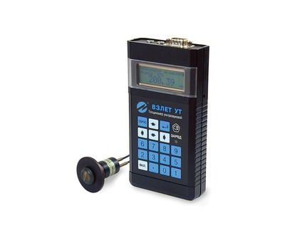

Толщиномер ультразвуковой. Предназначен для измерения толщины изделий и объектов из различных материалов, измерения скорости распространения ультразвука в материале с известным значением толщины.

===

### Исполнения:
* ВЗЛЕТ УТ - общепромышленное;
* ВЗЛЕТ УТ-М - морозоустойчивое.

<h3>Отличительные особенности:</h3>
<ul class="dash">
<li>автоматическая настройка;</li>
<li>работа на поверхностях со степенью шероховатости до 0,5 мм и радиусом кривизны от 10 мм;</li>
<li>наличие режимов работы, позволяющих производить измерения толщины через проводящее ультразвук покрытие;</li>
<li>отсутствие необходимости калибровки прибора в процессе работы;</li>
<li>возможность измерения толщины изделия из материала неизвестной марки при наличии образца известной толщины из данного материала;</li>
<li>автоматическое отключение питания после прекращения работы без потери информации;</li>
<li>встроенный справочник значений скорости распространения продольных волн в различных материалах.</li>
</ul>
<h3>Вывод информации:</h3>
<ul class="dash">
<li>на жидкокристаллический индикатор;</li>
<li>по последовательному интерфейсу RS-232.</li>
</ul>

<h3>Технические характеристики</h3>
<table class="pTable">
<tbody>
<tr><th>Характеристика</th><th>Значение</th></tr>
<tr>
<td lang="" dir="" scope="" align="" valign="top">Диапазон измеряемой толщины стальных изделий,мм</td>
<td>от&nbsp;1 до 300</td>
</tr>
<tr>
<td>Диапазон измеряемой скорости ультразвука, м/с</td>
<td>от&nbsp;1000 до 15 000</td>
</tr>
<tr>
<td rowspan="1" colspan="1">Погрешность измерения,%:</td>
<td rowspan="1" colspan="1">&nbsp;</td>
</tr>
<tr>
<td rowspan="1" colspan="1">&nbsp; &nbsp; &nbsp; - толщины</td>
<td rowspan="1" colspan="1">±(0,035+0,001 х h)*</td>
</tr>
<tr>
<td rowspan="1" colspan="1">&nbsp; &nbsp; &nbsp; -&nbsp;скорости ультразвука в диапазоне толщин от 20 до 300 мм, %</td>
<td rowspan="1" colspan="1">±0,5</td>
</tr>
<tr>
<td rowspan="1" colspan="1">Разрешающая способность:</td>
<td rowspan="1" colspan="1">&nbsp;</td>
</tr>
<tr>
<td rowspan="1" colspan="1">&nbsp; &nbsp; &nbsp; - при измерении толщины, мм</td>
<td rowspan="1" colspan="1">0,01</td>
</tr>
<tr>
<td rowspan="1" colspan="1">&nbsp; &nbsp; &nbsp; - при измерении скорости ультразвука, м/с</td>
<td rowspan="1" colspan="1">1</td>
</tr>
<tr>
<td>Диапазон рабочей температуры контактной поверхности, оС</td>
<td>от минус&nbsp;20 до 80</td>
</tr>
<tr>
<td rowspan="1" colspan="1">Максимальная допустимая температура поверхности объекта при кратковременном контакте, °С</td>
<td rowspan="1" colspan="1">150</td>
</tr>
<tr>
<td rowspan="1" colspan="1">Температура окружающей среды для вычислительного блока (ВБ), °С:</td>
<td rowspan="1" colspan="1">&nbsp;</td>
</tr>
<tr>
<td rowspan="1" colspan="1">&nbsp; &nbsp; &nbsp; - общепромышленное исполнение</td>
<td rowspan="1" colspan="1">от 0 до 50</td>
</tr>
<tr>
<td rowspan="1" colspan="1">&nbsp; &nbsp; &nbsp; - морозоустойчивое исполнение</td>
<td rowspan="1" colspan="1">от минус 20 до 50</td>
</tr>
<tr>
<td rowspan="1" colspan="1">Степень защиты ВБ/датчика</td>
<td rowspan="1" colspan="1">IP54/IP64</td>
</tr>
<tr>
<td rowspan="1" colspan="1">Глубина архивов измерительной информации, записей:</td>
<td rowspan="1" colspan="1">&nbsp;</td>
</tr>
<tr>
<td rowspan="1" colspan="1">&nbsp; &nbsp; &nbsp; - измеренных значений</td>
<td rowspan="1" colspan="1">1000</td>
</tr>
<tr>
<td rowspan="1" colspan="1">&nbsp; &nbsp; &nbsp; - параметров настроек</td>
<td rowspan="1" colspan="1">100</td>
</tr>
<tr>
<td rowspan="1" colspan="1">Время непрерывной работы,ч.</td>
<td rowspan="1" colspan="1">не менее 8</td>
</tr>
<tr>
<td rowspan="1" colspan="1">Средняя время&nbsp;наработки на отказ, ч.</td>
<td rowspan="1" colspan="1">100&nbsp;000</td>
</tr>
<tr>
<td>Средний срок службы, лет</td>
<td>12</td>
</tr>
<tr>
<td>Гарантийный срок эксплуатации, мес.</td>
<td>21**</td>
</tr>
<tr>
<td>Масса, кг</td>
<td>не более 0,4</td>
</tr>
<tr>
<td>Габаритные размеры, мм</td>
<td>85х160х30</td>
</tr>
</tbody>
</table>
<address>&nbsp;* h - измеряемая толщина, мм</address><address>** кроме датчика</address>
