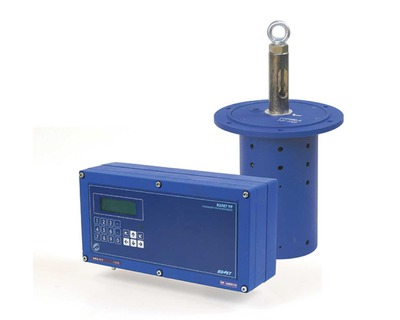

Уровнемер ультразвуковой.

===

Предназначен для бесконтактного измерения уровня различных жидкостей и дистанции до границы раздела сред.

Может использоваться в качестве сигнализатора или дальномера. Позволяет определять средний уровень и перепад уровней в двух точках, наполнение и объем жидкости в резервуарах с известными объемными характеристиками.

### Исполнения:
* УР-211, -211 Ex — одноканальные;
* УР-221, -221 Ex — двухканальные.

<h3>Отличительные особенности:</h3>
<ul class="dash">
<li>автоматический учет изменения скорости ультразвука при изменении параметров газовой среды;</li>
<li>минимальное влияние пены на поверхности жидкости на результаты измерений;</li>
<li>периодическая самоочистка пьезоэлектрического преобразователя (ПЭП) от конденсата и загрязнений;</li>
<li>возможность ввода объемной характеристики контролируемого резервуара;</li>
<li>возможность размещения блока измерения на удалении до 250 м от объекта измерения;</li>
<li>акустические системы могут комплектоваться высокотемпературными датчиками от 0 до 100 °C;</li>
<li>наличие взрывобезопасного исполнения;</li>
<li>возможность использования в качестве сигнализатора (до 8-ми значений уровня).</li>
</ul>
<h3>Исполнения акустических систем по стойкости к агрессивным средам:</h3>

<strong>АС-хх1-ххх</strong>&nbsp;– пары сточных вод, спиртов, кислот, ацитона, аммиака;&nbsp; <strong>АС-хх2-ххх</strong>&nbsp;– пары нефтепродуктов; <strong>АС-хх3-ххх</strong>&nbsp;- щелочей и кислот с концентрацией до 20%.

<h3>Исполнения акустических систем по комплектности и способу монтажа:</h3>

<strong>АС-111-113</strong>&nbsp;– без звуковода с термодатчиком (только для УР-211, -221); <strong>АС-40х-110</strong>&nbsp;– с репером и фланцевым креплением;&nbsp; <strong>АС-50х-110</strong>&nbsp;– с репером и подвесным креплением; <strong>АС-6хх-110</strong>&nbsp;– с термодатчиком и фланцевым креплением; <strong>АС-7хх-110</strong>&nbsp;– с термодатчиком и подвесным креплением.

<h3>Вывод информации:</h3>
<ul class="dash">
<li>на жидкокристаллический индикатор;</li>
<li>в виде частотных и/или импульсных сигналов (по заказу);</li>
<li>в виде нормированного токового сигнала (по заказу);</li>
<li>по интерфейсу Ethernet (по заказу);</li>
<li>по последовательному интерфейсу RS-232/RS-485;</li>
<li>в виде срабатывания логических выходов(по заказу).</li>
</ul>

<h3>Технические характеристики:</h3>
<table class="pTable">
<tbody>
<tr><th>Характеристика</th><th>УР-211, -211 Ех</th><th>УР-221, -221 Ех</th></tr>
<tr>
<td>Количество каналов измерения, шт.</td>
<td style="text-align: center;">1</td>
<td style="text-align: center;">2</td>
</tr>
<tr>
<td>Максимальная измеряемая дистанция, м:   - без блока взрывозащиты   - с блоком взрывозащиты</td>
<td style="text-align: center;" colspan="2"> 15 12</td>
</tr>
<tr>
<td>Определяемые параметры</td>
<td>уровень по одному каналу &nbsp;&nbsp;&nbsp;</td>
<td>- уровень по двум каналам  - перепад уровней  - средний уровень по двум каналам</td>
</tr>
<tr>
<td>Абсолютная погрешность измерения дистанции и уровня в изотропной среде, мм</td>
<td style="text-align: center;" colspan="2">не более ±4,0</td>
</tr>
<tr>
<td>Зона нечувствительности, м:   - для акустической системы с термодатчиком   - для акустической системы с репером</td>
<td style="text-align: center;" colspan="2"> 0,8  1,4</td>
</tr>
<tr>
<td>Длина соединительного кабеля акустических систем, м</td>
<td style="text-align: center;" colspan="2">до 250</td>
</tr>
<tr>
<td>Степень защиты:  - измерительного блока   - датчика</td>
<td style="text-align: center;" colspan="2"> IP54  IP67</td>
</tr>
<tr>
<td>Глубина архивов измерительной информации, записей:   - интервальный   - часовой   - суточный</td>
<td style="text-align: center;" colspan="2"> 6 000  1 440  60</td>
</tr>
<tr>
<td>Напряжение питания, В</td>
<td style="text-align: center;" colspan="2">=24</td>
</tr>
<tr>
<td>Потребляемая мощность, Вт</td>
<td style="text-align: center;" colspan="2">не более 20</td>
</tr>
<tr>
<td>Габаритные размеры измерительного блока, мм</td>
<td style="text-align: center;" colspan="2">250 х 135 х 90</td>
</tr>
<tr>
<td>Масса измерительного блока, кг</td>
<td style="text-align: center;" colspan="2">не более 3</td>
</tr>
<tr>
<td>Гарантийный срок эксплуатации, мес.</td>
<td style="text-align: center;" colspan="2">21</td>
</tr>
</tbody>
</table>
