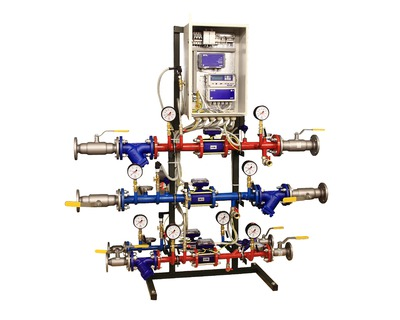

Модульные узлы учета.

===

Модульные узлы учета тепловой энергии (ВЗЛЕТ УУТЭ) и холодной воды (ВЗЛЕТ УУХВ) предназначены для измерения, индикации и регистрации параметров тепловой энергии и холодной воды, а также других параметров в системах различного типа. Позволяют осуществлять дистанционный контроль и автоматизированный сбор данных о потреблении ресурсов с выводом информации на пункт диспетчеризации. Наиболее эффективно использование совместно с модулями ВЗЛЕТ АТП при организации автоматизированной системы управления и учета энергоресурсов.

Модуль ВЗЛЕТ УУТЭ выполнен на базе теплосчетчика-регистратора ВЗЛЕТ ТСР-М. Для определения количества тепловой энергии применяется тепловычислитель ВЗЛЕТ ТСРВ. Выпускается в различных исполнениях. Конструкция модулей&nbsp;ВЗЛЕТ УУТЭ&nbsp;соответствует требованиям Постановления Правительства РФ от 18.11.2013 №1034 г. Москва "О коммерческом учете тепловой энергии, теплоносителя" и приказу Министерства Строительства и Жилищно-коммунального хозяйства РФ от 17.03.2014 №99/пр г. Москва "Об утверждении Методики осуществления коммерческого учета тепловой энергии, теплоносителя".

Модуль ВЗЛЕТ УУХВ выполнен на базе комплекса измерительно-вычислительного ВЗЛЕТ исполнение ИВК-102. В зависимости от наличия и конфигурации системы пожаротушения выпускается в трех исполнениях.

В составе модульных узлов производства ВЗЛЕТ применяются новейшие электромагнитные расходомеры-счетчики ВЗЛЕТ ЭР модификации Лайт М. По желанию заказчика модульные узлы комплектуются адаптерами сигналов ВЗЛЕТ АС для сотовой связи (АССВ-030) или для сети Ethernet (АСЕВ-040). Преобразователи расхода оснащены многоуровневой программной и аппаратной системой защиты от несанкционированного доступа.

<h3>Преимущества модульных узлов ВЗЛЕТ УУТЭ и ВЗЛЕТ УУХВ:</h3>
<ul class="dash">
<li>изготавливаются по типовым проектам, согласованным ведущими ТСО страны;</li>
<li>весь производственный цикл, включая электромонтаж, проходит в заводских условиях на современном высокотехнологичном оборудовании, что обеспечивает 100% контроль качества;</li>
<li>сертификат соответствия в системе добровольной сертификации;</li>
<li>широкий диапазон применения – позволяют найти решения для любых типов тепловых систем и систем водоснабжения;</li>
<li>оборудование и комплектующие от ведущих отечественных и зарубежных производителей (Взлет,&nbsp;Danfoss, Naval, Vexve и другие);</li>
<li>средства измерения, входящие в состав УУТЭ и УУХВ, внесены в Федеральный информационный фонд обеспечения единства измерений;</li>
<li>поставка в любую точку России;</li>
<li>уменьшение (по сравнению с монтажом «по месту») стоимости и сроков выполнения работ на объекте;</li>
<li>расширенная заводская гарантия.</li>
</ul>

Модульные узлы учета ориентированы, прежде всего, на использование на объектах ЖКХ, инфраструктурных и производственных объектах промышленных предприятий.

<h3>Технические характеристики ВЗЛЕТ УУТЭ:</h3>
<table class="pTable">
<tbody>
<tr><th>Характеристика</th><th>Значение</th></tr>
<tr>
<td>Максимальный измеряемый средний объемный расход теплоносителя, м3/ч</td>
<td>11,32-181,1</td>
</tr>
<tr>
<td>Максимальная скорость потока, м/с</td>
<td>10</td>
</tr>
<tr>
<td>Диапазон измерения объема (массы), м3, (т)</td>
<td>0-999999999</td>
</tr>
<tr>
<td>Диапазон измерения давления, МПа</td>
<td>от 0,1 до 2,5</td>
</tr>
<tr>
<td>Диапазон измерения температуры, °С</td>
<td>от 0 до 180</td>
</tr>
<tr>
<td>Диапазон измерения разности температур, °С</td>
<td>от 3 до 180</td>
</tr>
<tr>
<td>Диапазон измерения тепловой энергии, ГДж (Гкал)</td>
<td>0-999999999</td>
</tr>
<tr>
<td>Максимальное рабочее давление в теплосистеме, МПа</td>
<td>1,6</td>
</tr>
<tr>
<td>Гидравлические потери на арматуре и прямолинейных участках трубопроводов, м.вод.ст.</td>
<td>не более 0,5</td>
</tr>
</tbody>
</table>
<h3>Технические характеристики ВЗЛЕТ УУХВ:</h3>
<table class="pTable">
<tbody>
<tr><th>Характеристика</th><th>Значение</th></tr>
<tr>
<td>Максимальный измеряемый средний объемный расход теплоносителя, м3/ч</td>
<td>11,32-638,8</td>
</tr>
<tr>
<td>Максимальная скорость потока, м/с</td>
<td>10</td>
</tr>
<tr>
<td>Диапазон измерения объема воды, м3</td>
<td>0-999999999</td>
</tr>
<tr>
<td>Диапазон измерения давления воды, кПа</td>
<td>100-1600</td>
</tr>
<tr>
<td>Максимальное рабочее давление в трубопроводе, МПа</td>
<td>1,6</td>
</tr>
<tr>
<td>Гидравлические потери на арматуре и прямолинейных участках трубопроводов, м.вод.ст.</td>
<td>не более 0,5</td>
</tr>
</tbody>
</table>
