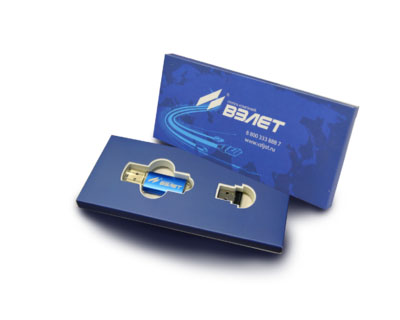

Программный комплекс.

===

«Взлет СП 4.0» (далее по тексту - ПК) предназначен для автоматического сбора, обработки, хранения и отображения информации с приборов учета тепловой и электрической энергии, расхода и количества жидкостей, газов, а также с приборов регулирования теплопотребления (автоматизированных тепловых пунктов).

Текущая версия продукта: `4.0.29.15` Подробности об использовании и ограничениях новой версии читайте [на форуме](http://vzljot.ru/forum/index.php?topic=6008).

<h3>Основные отличия новой версии:</h3>
<ul type="disc">
<li>клиент-серверная архитектура;</li>
<li>централизация доступа к данным и разграничение прав пользователей;</li>
<li>хранение архивных данных в физических единицах измерения;</li>
<li>встроенная отчетная система;</li>
<li>возможность поддержки различных СУБД;</li>
<li>возможность защищенного обмена данными;</li>
<li>горизонтальная масштабируемость комплекса.</li>
</ul>

ПК «Взлет СП» работает под управлением операционных систем семейства Windows, начиная с Windows 7 SP1 и выше. Все необходимые программные компоненты (кроме операционной системы) входят в установочный дистрибутив. Если потребуется, программа установки самостоятельно установит необходимые компоненты.

Программный комплекс поставляется в виде упакованного файла, после «распаковки» которого требуется запустить файл Setup.exe, в результате чего произойдет исполнение процедуры установки. 

<h3>Варианты установщика</h3>
<ul type="disc">
<li><a style="color: #005db0;" href="http://vzljot.ru/files/soft/sp4/vzljotsp.zip">VzljotSp</a>&nbsp;– установочный дистрибутив, со всеми компонентами, не включающий в себе установщик СУБД;</li>
<li><a style="color: #005db0;" href="http://vzljot.ru/files/soft/sp4/vzljotsp_mssql_x86.zip">VzljotSp_MSSQL_x86</a> – установочный дистрибутив, со всеми компонентами, включающий в себе установщик СУБД MS SQL Express 2008 R2 для 32-х разрядной операционной системы;</li>
<li><a style="color: #005db0;" href="http://vzljot.ru/files/soft/sp4/vzljotsp_mssql_x64.zip">VzljotSp_MSSQL_x64</a> – установочный дистрибутив, со всеми компонентами, включающий в себе установщик СУБД MS SQL Express 2008 R2 для 64-х разрядной операционной системы;</li>
<li><a style="color: #005db0;" href="http://vzljot.ru/files/soft/sp4/vzljotsp_adapters.zip">VzljotSp Adapters</a> – установочный дистрибутив, включающий в себе только программы настройки адаптеров.</li>
</ul>

Для обновления уже установленного комплекса достаточно установить вариант установщика без СУБД.

