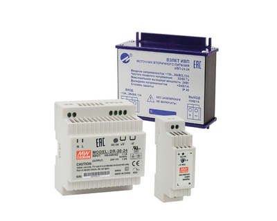

Предназначены для питания измерительной аппаратуры в условиях промышленной эксплуатации.

===

В приборах ГК ВЗЛЕТ в зависимости от требуемой мощности потребления могут использоваться источники вторичного питания: 
* DR-15-24 (15 Вт), 
* DR-30-24 (30 Вт) и 
* Взлет ИВП-ИВП-24.24(24 Вт).

`DR-15-24`, `DR-30-24` – применяются в составе приборов ВЗЛЕТ МР, ВЗЛЕТ УР, ВЗЛЕТ РСЛ, ВЗЛЕТ ЭР, ВЗЛЕТ ЭМ, ВЗЛЕТ ТЭР, ВЗЛЕТ ТСР-М, КИВ ВЗЛЕТ (ИВК-102) и ВЗЛЕТ АС.

Взлет `ИВП-24.24` - применяются в составе комплексов приборов (в том числе для АЭС) и в приборах ВЗЛЕТ ППД, КИВ ВЗЛЕТ (ИВК-101, ИВК-103).

<h3>Функциональные возможности:</h3>
<ul class="dash">
<li>широкий диапазон значений входного напряжения;</li>
<li>высокий уровень стабилизации выходного напряжения;</li>
<li>низкий уровень пульсаций выходного напряжения;</li>
<li>наличие защиты от перегрузки по выходу с автоматическим восстановлением.</li>
</ul>
<h3>Отличительные особенности:</h3>
<ul class="dash">
<li>непрерывный режим работы;</li>
<li>алюминиевый корпус-радиатор (ИВП-24.хх) обеспечивает устойчивый режим работы изделия в заданном диапазоне температуры окружающей среды.</li>
</ul>
<h3>Отличительные особенности Взлет ИВП-24.24:</h3>
<ul class="dash">
<li>конструктивно выполнен в алюминиевом корпусе-радиаторе, обеспечивающем устойчивый режим работы изделия во всем диапазоне температуры окружающей среды и повышенную устойчивость к воздействию негативных факторов окружающей среды;</li>
<li>имеет повышенную устойчивость к перенапряжениям в сети, возникающим в результате коммутационных переходных процессов и молниевых разрядов.</li>
</ul>
<h3>Изделие соответствует:</h3>
<ul class="dash">
<li>по устойчивости к воздействию синусоидальной вибрации - группе N2 по ГОСТ Р 52931-2008;</li>
<li>по устойчивости к изменению атмосферного давления - группе Р2 по ГОСТ Р 52931-2008;</li>
<li>по устойчивости к колебаниям напряжения электропитания - 3 степени жесткости по ГОСТ Р 51317.4.14-2000;</li>
<li>по устойчивости к динамическим изменениям напряжения электропитания - 2 степени жесткости по ГОСТ Р 51317.4.11-2007;</li>
<li>по устойчивости к наносекундным импульсным помехам - 3 степени жесткости по ГОСТ Р 51317.4.4-2007;</li>
<li>по устойчивости к микросекундным импульсным помехам большой энергии - 2 степени жесткости по ГОСТ Р 51317.4.5-99;</li>
<li>по устойчивости к изменениям частоты питающего напряжения - 4 степени жесткости по ГОСТ Р 51317.4.28-2000;</li>
<li>по уровню кондуктивных помех в цепях электропитания (0,15 - 30МГц) классу Б по ГОСТ Р 51318.22-2006;</li>
<li>по уровню излучаемых помех (30 - 1000 МГц) классу Б по ГОСТ Р 51318.22-2006;</li>
<li>по электробезопасности - II категории монтажа по ГОСТ Р 51350-99.</li>
</ul>

<h3>Технические характеристики</h3>
<table class="pTable">
<tbody>
<tr><th width="456">Характеристика</th><th width="131">DR-15-24</th><th width="144">DR-30-24</th><th width="144">ИВП-24.24</th></tr>
<tr>
<td>Напряжение питания (от однофазной сети переменного тока)</td>
<td>~(85-264)В, (47-63)Гц</td>
<td>(85-264)В, (47-63)Гц</td>
<td>(154-264)В, (40-60)Гц</td>
</tr>
<tr>
<td>Максимальная выходная мощность, Вт</td>
<td>15</td>
<td>30</td>
<td>24</td>
</tr>
<tr>
<td>Выходное напряжение, В</td>
<td>=24 ± 1%</td>
<td>=24 ± 1%</td>
<td>=24 ± 1%</td>
</tr>
<tr>
<td>Ток потребления при номинальном напряжении  сети и максимальной нагрузке, А</td>
<td>0,08</td>
<td>0,17</td>
<td>0,13</td>
</tr>
<tr>
<td>Пульсации выходного напряжения от пика до пика, не более, мВ</td>
<td>не более 150</td>
<td>не более 150</td>
<td>не более 50</td>
</tr>
<tr>
<td>Нестабильность выходного напряжения по сети, мВ</td>
<td>±240</td>
<td>±240</td>
<td>±50</td>
</tr>
<tr>
<td>Нестабильность выходного напряжения по нагрузке, мВ</td>
<td>±240</td>
<td>±240</td>
<td>±100</td>
</tr>
<tr>
<td>Ток срабатывания защиты от перегрузки, А</td>
<td>(1,1…1,6)×Iвых.макс.</td>
<td>(1,1…1,6)×Iвых.макс.</td>
<td>(1,1…1,5)×Iвых.макс.</td>
</tr>
<tr>
<td>КПД, не менее %</td>
<td>не менее 85</td>
<td>не менее 85</td>
<td>не менее 83</td>
</tr>
<tr>
<td>Прочность изоляции вход корпус/вход-выход, В</td>
<td>~1500 / ~4000</td>
<td>~1500 / ~4000</td>
<td>=1900/=3250</td>
</tr>
<tr>
<td>Температура окружающей среды (рабочая), °С</td>
<td>от минус 10 до 60</td>
<td>от минус 10 до 50</td>
<td>от 5 до 50</td>
</tr>
<tr>
<td>Степень защиты</td>
<td>IP20</td>
<td>IP20</td>
<td>IP40</td>
</tr>
<tr>
<td>Масса, не более кг</td>
<td>не более 0,1</td>
<td>не более 0,27</td>
<td>не более 0,25</td>
</tr>
<tr>
<td>Габаритные размеры, мм</td>
<td>40 × 90 × 100</td>
<td>78 × 93 × 56</td>
<td>100 × 95 × 55</td>
</tr>
<tr>
<td>Способ крепления</td>
<td>на DIN-рейку</td>
<td>на DIN-рейку</td>
<td>на DIN-рейку</td>
</tr>
</tbody>
</table>
