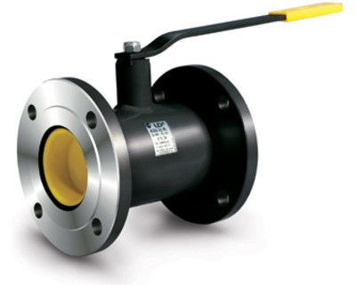

Шаровые краны LD относятся к трубопроводной арматуре промышленного назначения.

===

Они предназначены для перекрытия потока рабочей среды, эксплуатируемой в трубопроводах жилищно-коммунального и теплосетевого хозяйства.

Высокое качество Шаровых кранов LD обеспечивает максимальный класс герметичности затвора «А» по ГОСТ 9544-2005. В зависимости от исполнения Шаровые краны LD могут быть использованы как в умеренном, так и в холодном климате (У категории 1 и ХЛ категории 1 по Гост 15150-69).

<h3>Рабочие условия</h3>

Рабочая среда: нефтепродукты, горюче-смазочные материалы и жидкости без содержания абразивных примесей. Рабочие среды кранов из нержавеющих марок сталей – по отношению к которым применяемые материалы коррозионностойки. Рабочее давление: до 4,0 МПа. Температура рабочей среды: от - 60 °С до + 200 °С (в зависимости от климатического исполнения изделия) Температура окружающей среды: от - 60 °С до + 60 °С (в зависимости от климатического исполнения изделия)

<h3>Управление</h3>

Управление Шаровым краном LD можно осуществлять с помощью ручки, редуктора, пневмопривода, электропривода - непосредственно или дистанционно.

<h3>Испытания</h3>

На испытательных стендах с перегрузкой PN в 1,5 раза, согласно ГОСТ 9544-2005 «Арматура трубопроводная запорная.   Нормы герметичности затворов»:

<ul class="dash">
<li>на герметичность воздухом Рпр 6 кгс/см при t + 20°C;</li>
<li>на прочность и плотность водой:  ∙ для PN 1,6 МПа - 24 кгс/см2  ∙ для PN 2,5 МПа - 38 кгс/см2  ∙ для PN 4,0 МПа - 60 кгс/см2</li>
</ul>
