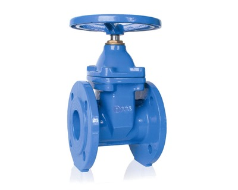

Устройство, устанавливаемое на трубопроводах, агрегатах, сосудах и предназначенное для управления потоками рабочих сред.

===

Продукция фирмы `Hornhof` (производство Польша) находит широкое применение в химической и нефтехимической промышленности, судостроении, тепловых сетях, сетях водоснабжения, водоотведения и объектах ЖКХ.

Продукция `IDMAR` (производство Польша), благодаря ее широкому применению, а также высокому качеству и надёжности, стала узнаваемой среди потребителей всего мира. Высокая техника, автоматизация и роботизация производственных процессов, применение новейших обрабатывающих центров в сочетании со всемирно известными проектными программами ставят IDMAR в число мировых лидеров с точки зрения качества производимой арматуры.

<h3>Водопроводная арматура Hornhof</h3>

<h4>Задвижки чугунные</h4>

Фланцевые клиновые заслонки используются на трубопроводах в качестве запорного устройства. Клиновая задвижка с обрезиненным клином применяется для герметичного перекрытия при работе с большим давлением среды, в трубопроводах воды и водяного пара.   <strong>Описание:</strong> Главное достоинство таких задвижек – это конструкция клина, который полностью обрезинен, благодаря чему достигается абсолютная герметичность, а также исключается возможность заеданий и появления царапин на механизме.  <strong>Рабочая среда:</strong> Системы холодной и горячей воды, любая не кислотная и не щелочная жидкость. Температурный режим от -20ᵒ С ÷ + 130ᵒ С. Давление PN 16.

<h4>Затворы</h4>

Межфланцевые дисковые затворы представляют собой особые регулирующие механизмы, пропускную способность в которых можно регулировать поворотом специальной заслонки. Это довольно известный и распространенный вид запорной арматуры. Затвор дисковый поворотный из нержавеющей стали активно применяется в системах водо- и теплоснабжения. В зависимости от использованного материала в затворе, он находит свое применение в морской воде, технической, питьевой, а также может быть использован для газов, нефтепродуктов и т. д. Использование межфланцевых затворов дисковых поворотных на сегодня получило большое распространение среди трубопроводной арматуры. Ведь они обладают такими очевидными преимуществами, как низкая стоимость, простота обслуживания и высокая герметичность.  <strong>Описание:</strong> По устройству - затвор поворотного типа с чугунным и нержавеющим диском.  <strong>Рабочая среда:</strong> Температурный режим от -20ᵒ С ÷ + 130ᵒ С. Температура зависит от вида уплотнения. Используются, главным образом, в установках питьевой воды и отопительных системах (холодная, горячая вода). Так же затворы используются в пищевой, химической и нефтехимической промышленности и т.п.  <strong>Управление:</strong> Управление дисковым затвором Hornhof можно осуществлять с помощью ручки.

<h4>Клапаны обратные</h4>

<strong>Описание:</strong> Одна из разновидностей автоматических предохранительных устройств – это клапан обратный межфланцевый двустворчатый. Он славится своим малым размером и выгодной ценой, что и послужило причиной его широкого распространения. Отличием от других является то, что межфланцевые виды при монтаже зажимается между фланцев.  <strong>Рабочая среда:</strong> Обратный клапан является одним из видов возвратного клапана, монтируется на трубопровод и находит применение в системах распределения воды, водоснабжения, теплоснабжении и т.д. Он пропускает рабочую среду только в одном нужном направлении. При изменении направления потока на обратное - такие клапаны автоматически закрываются, прекращая движение рабочей среды. Они активно применяются в работах с трубопроводами.

<h4>Фильтр сетчатый с магнитной вставкой</h4>

<strong>Описание:</strong> Фильтры сетчатые грязевые (с магнитной вставкой) предназначены для предварительной очистки воды или воды в системах горячего водоснабжения, протекающей по трубопроводу. Магнитно-механические фильтры (ФМФ) действуют по следующему принципу - когда поток жидкости протекает через фильтрующее магнитное звено устройства, на специальной сетке задержатся все нежелательные частицы. В случае магнитно-фланцевых фильтров – должны задержаться частицы даже самых микроскопических размеров.  <strong>Применение:</strong> Пар, холодная, горячая вода, в установках горячей воды с повышенным давлением, жидкости, не обладающие кислотными и щелочными свойствами, сжатый воздух.

    
<h3>Водопроводная арматура IDMAR</h3>

<h4>Затвор межфланцевый</h4>

<strong>Описание:</strong> Затвор межфланцевый из нержавеющей стали X5CrNi18-10. Возможно изготовление из других материалов по согласованию.  <strong>Рабочая среда:</strong> Агрессивные агенты по таблице устойчивости для стали X5CrNi18-10, отопительные, водопроводные системы и промышленные установки. Температурный режим от -20ᵒ С ÷ + 130ᵒ С. Давление PN 16.  <strong>Управление:</strong> ручка.

<h4>Краны шаровые кислостойкие</h4>

<strong>Рабочая среда:</strong> Агрессивные среды, нефть и нефтепродукты. Температурный режим от -30ᵒ С ÷ + 160ᵒ С. Давление PN 16/25/40 бар.  <strong>Исполнение:</strong> соединение - приварное, фланцевое. Выполнены из нержавеющей стали.  <strong>Управление:</strong> ручка, возможно исполнение: редуктор, эл. привод, пневмопривод.

<h3>Шаровые краны VALTEC</h3>

Качественная трубопроводная арматура – обязательное условие безаварийной работы систем водоснабжения и водяного отопления. Шаровые краны VALTEC – это надежная запорная арматура. Корпусы кранов изготавливаются из латуни марки CW617N (европейский стандарт EN 12165), штоки и шаровые затворы – из латуни марки CW614N (EN 12164). На корпус кранов наносится защитное гальваническое покрытие.   Область применения шаровых кранов VALTEC для воды включает в себя холодное и горячее водоснабжение, в том числе – питьевое, отопление, транспортировку сжатого воздуха, углеводородов, других жидкостей, неагрессивных к материалам крана.  Диапазон допустимых температур: от –30 до +150 °С. Нормативное давление – от 40 до 16 бар, в зависимости от типоразмера.

