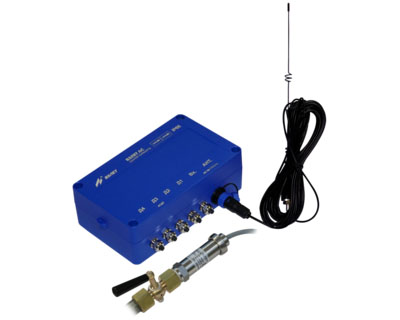

Адаптер сигналов.

===

Предназначен для передачи текущих и накопленных данных, а также сообщений о нештатных ситуациях от датчиков давления в диспетчерскую систему, построенную, в том числе, и на базе программного комплекса «ВЗЛЕТ СП».

### Отличительные особенности:
* четыре канала подключения датчиков давления;
* энергонезависимый (до 48 месяцев);
* цифровые датчики давления;
* быстрая инсталляция;
* степень защиты адаптера соответствует коду IP68 по ГОСТ 14254.

<h3>Технические характеристики:</h3>
<table class="pTable">
<tbody>
<tr><th>Характеристика</th><th>Значение, обозначение</th></tr>
<tr>
<td>

Входные сигналы:&nbsp;

- преобразователей давления  - интерфейса RS-485  - внешних датчиков  - дискретные входные сигналы, В:  &nbsp; уровень «0»  &nbsp; уровень «1»

</td>
<td>

&nbsp;

до 4  А, В  до 2

0 – 1  2,5 – 5,0

</td>
</tr>
<tr>
<td>

Выходной сигнал:&nbsp;

- частота, МГц  - мощность, мВт, не менее

</td>
<td>

&nbsp;

900/1800  2000

</td>
</tr>
<tr>
<td>Напряжение питания, В&nbsp;</td>
<td>=7,2</td>
</tr>
<tr>
<td rowspan="1" colspan="1">Потребляемая мощность, ВА, не более&nbsp;</td>
<td rowspan="1" colspan="1">2</td>
</tr>
<tr>
<td rowspan="1" colspan="1">Средняя наработка на отказ, ч&nbsp;</td>
<td rowspan="1" colspan="1">75 000</td>
</tr>
<tr>
<td rowspan="1" colspan="1">Срок службы, лет&nbsp;</td>
<td rowspan="1" colspan="1">12</td>
</tr>
<tr>
<td>&nbsp;Сохранение результатов работы в архивах:

- часовой - суточный - месячный

</td>
<td>

&nbsp;

1080 записей 365 записей 48 записей (до 4 лет)

</td>
</tr>
<tr>
<td>

&nbsp;Устойчивость адаптера к внешним воздействующим факторам в соответствии с требованиям ГОСТ Р 52931:

- температура окружающего воздуха - относительная влажность - атмосферное давление - вибрация – в диапазоне

</td>
<td>

&nbsp;

от 5 до 50 С не более 80% при температуре до 35 С, без конденсации влаги от 66,0 до 106,7 кПа от 10 до 55 Гц с амплитудой до 0,35 мм

</td>
</tr>
</tbody>
</table>

Время сохранности архивных, а также установочных данных при отключении питания и полном разряде батарей не менее 5 лет.

Питание адаптера осуществляется от двух последовательно соединенных батарей напряжением 3,6 В, размера D, емкостью до 14 А.ч, обеспечивающих поддержание работоспособности прибора до 48 месяцев.

