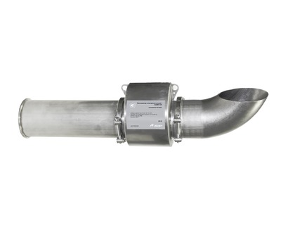

Расходомер-счетчик электромагнитный

===

Расходомер-счетчик электромагнитный «ВЗЛЕТ СК» предназначен для измерения среднего объемного расхода и объема холодной воды, бытовых и промышленных стоков, в том числе, загрязненных и с твердыми включениями электропроводящих жидкостей в широком диапазоне значений температуры и проводимости.

Основная сфера применения расходомеров «ВЗЛЕТ СК» – в составе измерительных систем, автоматизированных систем управления технологическими процессами в энергетике, коммунальном хозяйстве и т.д.

<table class="table">
<tbody>
<tr><th>Характеристика</th><th colspan="6">Значение</th></tr>
<tr>
<td>Номинальный диаметр, DN</td>
<td rowspan="1" colspan="1">80</td>
<td>100</td>
<td>150</td>
<td>200</td>
<td rowspan="1" colspan="1">250</td>
<td>300</td>
</tr>
<tr>
<td>Наиб. измеряемый средний объемный расход жидкости, Qнаиб, м3/ч</td>
<td rowspan="1" colspan="1">108,7</td>
<td>169,2</td>
<td>382</td>
<td>679</td>
<td rowspan="1" colspan="1">1061</td>
<td>1528</td>
</tr>
<tr>
<td>Максимальная скорость потока рабочей жидкости, м/с</td>
<td colspan="6">6,0</td>
</tr>
<tr>
<td>Чувствительность расходомера по скорости потока, м/с</td>
<td colspan="6">0,01</td>
</tr>
<tr>
<td>Температура жидкости, °С</td>
<td colspan="6">от минус 5 до 50</td>
</tr>
<tr>
<td>Удельная проводимость рабо-чей жидкости, См/м</td>
<td colspan="6">не менее 5·10-4</td>
</tr>
<tr>
<td>Степень защиты</td>
<td colspan="6">IP68</td>
</tr>
<tr>
<td>Напряжение питания расходомера, В</td>
<td colspan="6">=24</td>
</tr>
</tbody>
</table>