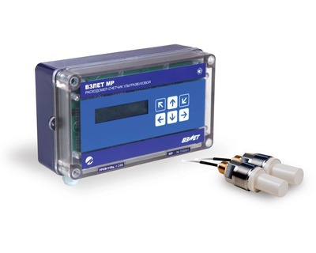

Расходомер-счетчик ультразвуковой.

Оптимальный выбор для организации коммерческих узлов учета тепловой энергии и воды.

===

Предназначен для измерения с повышенной точностью среднего объемного расхода и объема реверсивных потоков различных жидкостей (горячей, холодной, сточных вод, кислот, щелочей, пищевых продуктов и т.д.) в одном или двух напорных трубопроводах при различных условиях эксплуатации. Сохраняет все преимущества прибора УРСВ-5ххц при одновременной оптимизации цены.

<h3>Исполнения:</h3>

<strong>УРСВ-110ц</strong>&nbsp;- одноканальное; <strong>УРСВ-120ц</strong>&nbsp;- двухканальное; <strong>УРСВ-122ц</strong>&nbsp;- двухлучевое для одного трубопровода.

<h3>Отличительные особенности:</h3>
<ul class="dash">
<li>цифровая обработка сигнала, минимальное время одного измерения, высокая помехозащищенность;</li>
<li>надежная работа прибора при изменении температуры, давления, вязкости и других параметров жидкости;</li>
<li>значительное упрощение пусконаладочных работ (без применения осциллографа);</li>
<li>измерение расхода и объема реверсивного потока;</li>
<li>датчики врезные;</li>
<li>возможна поставка с готовым измерительным участком;</li>
<li>измерение без потерь давления в трубопроводе;</li>
</ul>
<h3>Вывод информации:</h3>
<ul class="dash">
<li>на жидкокристаллический индикатор;</li>
<li>в виде импульсов с нормированным весом или логических сигналов;</li>
<li>по последовательному интерфейсу RS-485.</li>
</ul>

<table class="pTable">
<tbody>
<tr><th rowspan="2">Характеристика</th><th colspan="2">Значение</th></tr>
<tr><th>УРСВ-1х0 ц</th><th>УРСВ-122 ц</th></tr>
<tr>
<td>Количество контролируемых трубопроводов</td>
<td class="center">от 1 до 2</td>
<td class="center" style="text-align: center;">1</td>
</tr>
<tr>
<td>Номинальный диаметр, DN</td>
<td class="center" style="text-align: center;" colspan="2">от 200 до 5 000</td>
</tr>
<tr>
<td>Относительная погрешность измерения расхода (объема), %</td>
<td class="center">±(0,95+0,1/v)*</td>
<td class="center" style="text-align: center;">±(0,45+0,1/v)*</td>
</tr>
<tr>
<td>Диапазон температуры жидкости, °С</td>
<td class="center" style="text-align: center;" colspan="2">от минус 30 до 160</td>
</tr>
<tr>
<td>Температура окружающей среды для вторичного преобразователя (ВП), °С</td>
<td class="center" style="text-align: center;" colspan="2">от 5 до 50</td>
</tr>
<tr>
<td>наибольшее давление в трубопроводе для врезных преобразователей электроакустических (ПЭА), МПа</td>
<td class="center" style="text-align: center;" colspan="2">2,5</td>
</tr>
<tr>
<td>Степень защиты ВП/ПЭА</td>
<td class="center" style="text-align: center;" colspan="2">IP54/IP68</td>
</tr>
<tr>
<td>Напряжение питания расходомера, В</td>
<td class="center" style="text-align: center;" colspan="2">=24</td>
</tr>
<tr>
<td>Потребляемая мощность, Вт</td>
<td class="center" style="text-align: center;" colspan="2">не более 12</td>
</tr>
<tr>
<td>Среднее время наработки на отказ, ч</td>
<td class="center" style="text-align: center;" colspan="2">75 000</td>
</tr>
<tr>
<td>Средний срок службы, лет</td>
<td class="center" style="text-align: center;" colspan="2">12</td>
</tr>
<tr>
<td>Гарантийный срок эксплуатации, мес</td>
<td class="center" style="text-align: center;" colspan="2">25</td>
</tr>
<tr>
<td>Масса ВП, кг</td>
<td class="center" style="text-align: center;" colspan="2">не более 1</td>
</tr>
<tr>
<td>Габаритные размеры ВП, мм</td>
<td class="center" style="text-align: center;" colspan="2">190х125х60</td>
</tr>
</tbody>
</table>