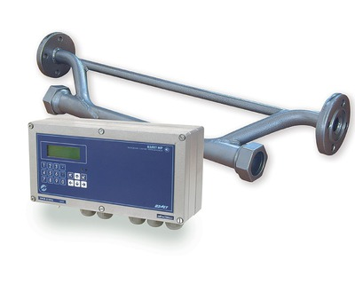

Расходомер-счетчик ультразвуковой для вязких жидкостей.

Предназначен для измерения объемного расхода и объема нефти и нефтепродуктов (в том числе мазута), а также других вязких жидкостей.

===

<h3>Отличительные особенности:</h3>
<ul class="dash">
<li>измерение расхода и объема реверсивного потока;</li>
<li>измерение без потерь давления в трубопроводе;</li>
<li>наличие режима дозирования объема;</li>
<li>определение массового расхода и массы контролируемой жидкости;</li>
<li>автоматический учет изменения вязкости и плотности жидкости при изменении температуры и давления жидкости в трубопроводе.</li>
</ul>
<h3>Вывод информации:</h3>
<ul class="dash">
<li>на жидкокристаллический индикатор;</li>
<li>в виде нормированного токового сигнала (по заказу);</li>
<li>в виде импульсов с нормированным весом или логических сигналов (по заказу);</li>
<li>по последовательному интерфейсу RS-232/RS-485;</li>
<li>по интерфейсу Ethernet (по заказу).</li>
</ul>

<h3>Технические характеристики</h3>
<table class="pTable">
<tbody>
<tr><th>Характеристика</th><th>Значение</th></tr>
<tr>
<td lang="" dir="" scope="" align="" valign="top">Номинальный диаметр, DN</td>
<td style="text-align: left;">&nbsp;от 10 до 5 000</td>
</tr>
<tr>
<td rowspan="1" colspan="1">Относительная погрешность измерения расхода (объема),%</td>
<td rowspan="1" colspan="1">±(1,2 +0,2/v)*</td>
</tr>
<tr>
<td rowspan="1" colspan="1">Диапазон температуры жидкости, оC</td>
<td rowspan="1" colspan="1">от минус 30 до 160</td>
</tr>
<tr>
<td>Температура окружающей среды для вторичного преобразователя (ВП), оС</td>
<td>от 0 до 50</td>
</tr>
<tr>
<td>Давление в трубопроводе для врезных преобразователей электроакустических (ПЭА), МПа</td>
<td>не более 2,5**</td>
</tr>
<tr>
<td rowspan="1" colspan="1">Длина сигнального кабеля ВП-ПЭА, м</td>
<td rowspan="1" colspan="1">до 250</td>
</tr>
<tr>
<td>Степень защиты ВП/ПЭА</td>
<td>IP54/IP68</td>
</tr>
<tr>
<td rowspan="1" colspan="1">Маркировка взрывозащиты:</td>
<td rowspan="1" colspan="1">&nbsp;</td>
</tr>
<tr>
<td rowspan="1" colspan="1">&nbsp; &nbsp; &nbsp;- блок искрозащиты</td>
<td rowspan="1" colspan="1">[Exia]IIB</td>
</tr>
<tr>
<td rowspan="1" colspan="1">&nbsp; &nbsp; &nbsp;- ПЭА</td>
<td rowspan="1" colspan="1">0ExiaIIBT6X</td>
</tr>
<tr>
<td rowspan="1" colspan="1">Глубина архивов измерительной информации, записей:</td>
<td rowspan="1" colspan="1">&nbsp;</td>
</tr>
<tr>
<td rowspan="1" colspan="1">&nbsp; &nbsp; &nbsp;- часового</td>
<td rowspan="1" colspan="1">1440</td>
</tr>
<tr>
<td rowspan="1" colspan="1">&nbsp; &nbsp; &nbsp;- суточного</td>
<td rowspan="1" colspan="1">60</td>
</tr>
<tr>
<td rowspan="1" colspan="1">&nbsp; &nbsp; &nbsp;- месячного</td>
<td rowspan="1" colspan="1">48</td>
</tr>
<tr>
<td rowspan="1" colspan="1">&nbsp; &nbsp; &nbsp;- интервального</td>
<td rowspan="1" colspan="1">14 400</td>
</tr>
<tr>
<td rowspan="1" colspan="1">&nbsp; &nbsp; &nbsp;- дозирования</td>
<td rowspan="1" colspan="1">512</td>
</tr>
<tr>
<td rowspan="1" colspan="1">Питание</td>
<td rowspan="1" colspan="1">=24В</td>
</tr>
<tr>
<td rowspan="1" colspan="1">Потребляемая мощность, Вт</td>
<td rowspan="1" colspan="1">не более 12</td>
</tr>
<tr>
<td>Средняя наработка на отказ, ч.</td>
<td>75 000</td>
</tr>
<tr>
<td>Средний срок службы, лет</td>
<td>12</td>
</tr>
<tr>
<td>Гарантийный срок эксплуатации, мес.</td>
<td>25</td>
</tr>
<tr>
<td>Масса вторичного преобразователя, кг</td>
<td>не более 3</td>
</tr>
<tr>
<td>Габаритные размеры вторичного преобразователя, мм</td>
<td>250х154х75</td>
</tr>
</tbody>
</table>
<address>&nbsp;* v - скорость потока, м/с</address><address>** может быть увеличено по заказу</address><address>&nbsp;</address>
