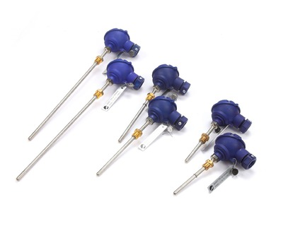

Термопреобразователи сопротивления.

===

Предназначены для измерения температуры и разности температур различных сред.

Могут применяться в теплоэнергетике, химической, пищевой и других отраслях промышленности.

<h3>Технические характеристики</h3>
<table class="pTable">
<tbody>
<tr><th>Характеристика</th><th>Значение</th></tr>
<tr>
<td>Номинальное значение сопротивления</td>
<td>Pt100, Pt500</td>
</tr>
<tr>
<td>Диапазон измеряемой температуры, °С</td>
<td>от 0 до 180 (от минус 50 до 100)*</td>
</tr>
<tr>
<td>Диапазон измерения разности температур, °С</td>
<td>3 - 180</td>
</tr>
<tr>
<td>Класс допуска одиночных преобразователей температуры</td>
<td>А, В</td>
</tr>
<tr>
<td>Класс точности согласованной пары</td>
<td>1, 2</td>
</tr>
<tr>
<td>Длина монтажной части, мм</td>
<td>32, 40, 50, 70, 98, 133, 223</td>
</tr>
<tr>
<td>Степень защиты</td>
<td>IP 65</td>
</tr>
<tr>
<td>Температура окружающей среды, °С</td>
<td>от минус 50 до 100</td>
</tr>
<tr>
<td>Средний срок службы, лет</td>
<td>12</td>
</tr>
</tbody>
</table>

*одиночные (по заказу)

<h4>Возможные исполнения термопреобразователей:</h4>

- с подвижным штуцером (тип DL);

- без штуцера (тип PL).

Возможна комплектация ТПС защитной гильзой, прямой или наклонной бобышкой (по заказу).

Исполнение коммутационной коробки – ударопрочная термостойкая пластмасса.

