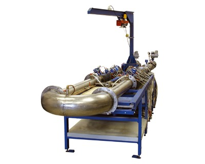

Установка поверочная водопроливная.

===

Предназначена для настройки, градуировки, калибровки, юстировки, поверки сличением и других работ по определению метрологических и технических характеристик расходомеров, расходомеров-счетчиков, счетчиков, преобразователей расхода жидкости различного типа и назначения.

Установка зарегистрирована в Федеральном информационном фонде по обеспечению единства измерений.

Установка поверочная водопроливная ВЗЛЕТ ПУ представляет собой автоматизированный измерительно-испытательный комплекс, имеющий в своем составе информационно-измерительную и управляющую систему на базе персонального компьютера.

Установка предназначена для организаций, занимающихся производством, ремонтом, калибровкой и поверкой приборов измерения расхода и объема жидкостей.

Установка размещается на одном уровне. Предусматривается отделение насосной группы шумоизоляционной стеной, обеспечивающей комфортные условия для обслуживающего персонала. По отдельному проекту возможна доработка типового исполнения и размещение с привязкой к конкретному помещению в том числе на разных уровнях.

<h3>Исполнения:</h3>

<strong>ВПУ-03</strong>/ диаметры условного прохода поверяемых приборов от&nbsp;10&nbsp;до&nbsp;80 (100)* мм; <strong>ВПУ-05</strong>/ диаметры условного прохода поверяемых приборов от&nbsp;10&nbsp;до&nbsp;150 (200)* мм; <strong>ВПУ-07</strong>/ диаметры условного прохода поверяемых приборов от&nbsp;10&nbsp;до&nbsp;300 мм.

<address>* по&nbsp;заказу</address>
<h3>Функциональные возможности:</h3>
<ul class="dash">
<li>поддержание стабильного расхода рабочей жидкости и воспроизводимость условий испытаний по длине испытательного участка рабочего стола;</li>
<li>плавная установка значения расхода с помощью регулируемого привода насоса;</li>
<li>длины прямолинейных участков не менее 10 диаметров условного прохода поверяемых приборов.</li>
</ul>
<h3>Отличительные особенности:</h3>
<ul class="dash">
<li>оснащена эталонными весовыми устройствами и эталонными расходомерами;</li>
<li>изготовлена из коррозионностойких материалов;</li>
<li>может обслуживаться одним оператором благодаря автоматизированной системе сбора и обработки результатов измерений;</li>
<li>экономия энергопотребления (за счет регулируемого привода насоса) и рабочей жидкости (за счет циркуляции по замкнутому контуру);</li>
<li>изготовление, монтаж, настройка и запуск установки в работу «под ключ», в том числе государственная поверка;</li>
<li>постгарантийное сопровождение.</li>
</ul>
<h3>Состав установки (основные блоки):</h3>
<ul class="dash">
<li>накопительный бак-резервуар для хранения и деаэрации рабочей жидкости;</li>
<li>насосы с&nbsp;регулируемым электроприводом;</li>
<li>ресиверы для деаэрации и&nbsp;обеспечения стабильности расхода жидкости;</li>
<li>эталонные весоизмерительные устройства с&nbsp;переключателями потока;</li>
<li>эталонные расходомеровы с&nbsp;системой задания и&nbsp;регулирования расхода;</li>
<li>рабочие столы с&nbsp;испытательными участками для поверяемых приборов;</li>
<li>рабочее место оператора;</li>
<li>измерительный аппаратно-программный комплекс;</li>
<li>трубопроводная обвязка с&nbsp;запорно-регулирующей арматурой;</li>
<li>система заполнения установки рабочей жидкостью;</li>
<li>система сбора, очистки и&nbsp;возврата рабочей жидкости.</li>
</ul>
<h3>Измерительный аппаратно-программный комплекс (ИАПК)</h3>

ИАПК предназначен для управления работой поверочной установки, а&nbsp;также автоматизированного сбора и&nbsp;обработки результатов измерения при проведении операций настройки, юстировки, калибровки и&nbsp;поверки приборов расхода жидкостей.

<h3>Функциональные возможности ИАПК:</h3>
<ul class="dash">
<li>проведение процедуры поверки и калибровки статическим весовым методом одновременно до 56 приборов (включая эталонные расходомеры);</li>
<li>устанавливает и поддерживает заданное оператором значение расхода рабочей жидкости;</li>
<li>управляет работой переключателя потока по командам оператора, по завершению цикла проливки, по заполнению весового бака;</li>
<li>измеряет температуру рабочей жидкости в магистралях поверочной установки по двум каналам в режиме реального времени.</li>
</ul>
<h3>Отличительные особенности ИАПК:</h3>
<ul class="dash">
<li>осуществляет связь с поверяемыми приборами по интерфейсу RS-485 или RS-232;</li>
<li>обеспечивает запуск программного обеспечения, необходимого для связи по интерфейсу с поверяемыми приборами сторонних производителей, и возврат в оболочку по завершению связи для продолжения работы;</li>
<li>проводит самотестирование в процессе работы;</li>
<li>архивация и протоколирования результатов.</li>
</ul>

<h3>Технические характеристики ВЗЛЕТ ПУ:</h3>
<table class="pTable">
<tbody>
<tr><th>Характеристика</th><th>Значение</th></tr>
<tr>
<td>Температура рабочей жидкости, °С</td>
<td style="text-align: center;">от 10 до 40</td>
</tr>
<tr>
<td>Давление в трубопроводе, МПа</td>
<td style="text-align: center;">не менее 0,1</td>
</tr>
<tr>
<td>Напряжение питания насосов и электроприводов от трехфазной сети переменного тока</td>
<td style="text-align: center;">~380 В 50 Гц</td>
</tr>
</tbody>
</table>
<h3>Исполнение ВПУ-03/DN10- DN80 (типовое)</h3>
<table class="pTable">
<tbody>
<tr><th>Характеристика</th><th>Значение</th></tr>
<tr>
<td>Номинальный диаметр испытываемых приборов, DN</td>
<td style="text-align: center;">от 10 до 80*</td>
</tr>
<tr>
<td>Диапазон воспроизводимого расхода, м3/ч</td>
<td style="text-align: center;">от 0,03 до 100</td>
</tr>
<tr>
<td>Количество рабочих столов</td>
<td style="text-align: center;">1</td>
</tr>
<tr>
<td>Длина испытательного участка рабочего стола под поверяемые приборы, мм</td>
<td style="text-align: center;">2 x 1200</td>
</tr>
<tr>
<td>Пределы допускаемой относительной погрешности измерения при поверке  методом сличения с помощью эталонных расходомеров, %</td>
<td style="text-align: center;">±0,3**</td>
</tr>
<tr>
<td>Пределы допускаемой относительной погрешности измерения при поверке статическим весовым методом, %</td>
<td style="text-align: center;">±0,05; ±0,1</td>
</tr>
<tr>
<td>Габаритные размеры установки, мм</td>
<td style="text-align: center;">9 600 × 3 000 х 2 830</td>
</tr>
</tbody>
</table>

<small>* по заказу до DN 100   ** по заказу комплектуется эталонными приборами класса 0,15; 0,2</small>

<h2>Состав установки:</h2>

— стенд малых диаметров СМД.

<h3>Исполнение ВПУ-05/ DN10- DN150 (типовое)</h3>
<table class="pTable">
<tbody>
<tr><th rowspan="2">Характеристика</th><th colspan="2">Значение</th></tr>
<tr><th>СМД</th><th>СБД</th></tr>
<tr>
<td>Номинальный диаметр испытываемых приборов, DN</td>
<td style="text-align: center;">от 10 до 65</td>
<td style="text-align: center;">от 80 до 150*</td>
</tr>
<tr>
<td>Диапазон воспроизводимого расхода, м3/ч</td>
<td style="text-align: center;">от 0,03 до 80</td>
<td style="text-align: center;">от 0,3 до 450</td>
</tr>
<tr>
<td>Количество рабочих столов / длина испытательного участка для поверяемых приборов, мм</td>
<td style="text-align: center;">1/2 x 1200</td>
<td style="text-align: center;">1/2 x 2100</td>
</tr>
<tr>
<td>Пределы допускаемой относительной погрешности измерения  при поверке методом сличения с помощью эталонных расходомеров, %</td>
<td style="text-align: center;" colspan="2">±0,3**</td>
</tr>
<tr>
<td>Пределы допускаемой относительной погрешности измерения при поверке статическим весовым методом, %</td>
<td style="text-align: center;" colspan="2">±0,05; ±0,1</td>
</tr>
<tr>
<td>Габаритные размеры установки, мм</td>
<td style="text-align: center;" colspan="2">15 500 × 4 600 х 3 800</td>
</tr>
</tbody>
</table>

<small>* по заказу до DN 200   ** по заказу комплектуется эталонными приборами класса 0,15; 0,2.</small>

<h2>Состав установки:</h2>

- стенд малых диаметров СМД;  - стенд больших диаметров СБД.

<h3>Исполнение ВПУ-07/ DN10- DN300 (типовое)</h3>
<table class="pTable">
<tbody>
<tr><th rowspan="2">Характеристика</th><th colspan="3">Значение</th></tr>
<tr><th>СМД</th><th>СД300</th></tr>
<tr>
<td>Номинальный диаметр испытываемых приборов, DN</td>
<td style="text-align: center;">от 10 до 80</td>
<td style="text-align: center;">от 100 до 300</td>
</tr>
<tr>
<td>Диапазон воспроизводимого расхода, м3/ч</td>
<td style="text-align: center;">от 0,03 до 100</td>
<td style="text-align: center;">от 0,3 до 450</td>
</tr>
<tr>
<td style="text-align: left;">Количество рабочих столов / длина испытательного участка для&nbsp;поверяемых приборов, мм</td>
<td style="text-align: center;">1/2 x 1200</td>
<td style="text-align: center;">1 x 1560</td>
</tr>
<tr>
<td>Пределы допускаемой относительной погрешности измерения  при поверке методом сличения с помощью эталонных расходомеров, %</td>
<td style="text-align: center;" colspan="3">±0,3*</td>
</tr>
<tr>
<td>Пределы допускаемой относительной погрешности измерения  при поверке статическим весовым методом, %</td>
<td style="text-align: center;" colspan="3">±0,05; ±0,1</td>
</tr>
<tr>
<td>Габариты размеры установки, мм</td>
<td style="text-align: center;" colspan="3">16 600 × 7 200 х 3 800</td>
</tr>
</tbody>
</table>

<small>* по заказу комплектуется эталонными приборами класса 0,15; 0,2</small>

<h2>Состав установки:</h2>

- стенд малых диаметров СМД;  - стенд больших диаметров СД300.

