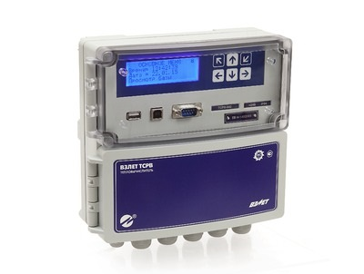
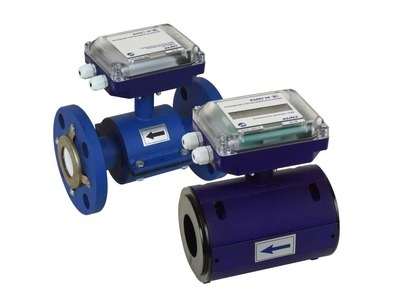
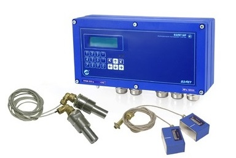
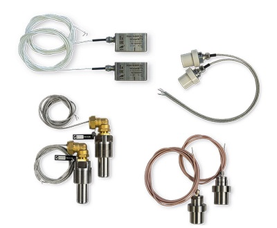
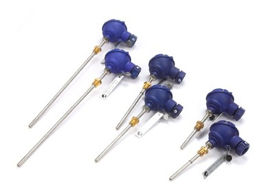
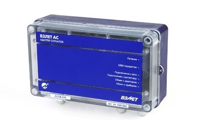
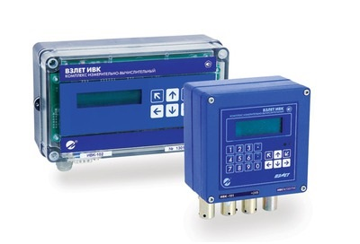

#Продукция

### Теплосчетчики и тепловычислители
  - Тепловычислители `Взлет ТСРВ`
  - Теплосчетчики-регистраторы `Взлет ТСР смарт` (тип присоединения - фланец)
  - Теплосчетчики-регистраторы `Взлет ТСР-К`

### Расходомеры электромагнитные
  - Расходомеры-счетчики электромагнитные `Взлет ЭР`, модификация `Лайт М`
  - Имитаторы габаритные для электромагнитных расходомеров `Взлет ЭР`, `Взлет ЭМ`
  - Присоединительная арматура из стали СТ для электромагнитных расходомеров `Взлет ЭР`, `Взлет ЭМ` (рmax до 2,5 мпа)
  - Присоединительная арматура для `Взлет ЭМ` и `Взлет ЭР` комплект №2
  - Комплект присоединительной арматуры `Взлет КПА`
  - Расходомер-счетчик электромагнитный `Взлет ЭМ` исполнения `Профи-хх2 МО`
  - Расходомер-счетчик электромагнитный `Взлет СК`

### Расходомеры ультразвуковые
  - Расходомер-счетчик ультразвуковой `Взлет МР`, исполнение `УРСВ-011`
  - Расходомер-счетчик ультразвуковой `Взлет МР`, исполнение `УРСВ-310`
  - Расходомер-счетчик ультразвуковой `Взлет МР`, исполнение `УРСВ-311`
  - Расходомер-счетчик ультразвуковой `Взлет МР`, исполнение `УРСВ-1ххц`
  - Расходомер-счетчик ультразвуковой `Взлет МР`, исполнение `УРСВ-5ххц`
  - Расходомер-счетчик ультразвуковой `Взлет РСЛ` исполнения `РСЛ-212` и `РСЛ-222` для безнапорных трубопроводов и открытых - каналов
  - Уровнемер ультразвуковой `Взлет УР` цифровой исполнения `УР-2хх`
  - Расходомер-счетчик ультразвуковой переносной `Взлет ПРЦ`

### Дополнительная комплектация
  - Дополнительная комплектация к расходомерам-счетчикам ультразвуковым `Взлет МР` общего применения (`УРСВ-1хх Ц`,  `УРСВ-5хх Ц`)
  - ПЭА (пара) к расходомерам-счетчикам ультразвуков `Взлет МР` общего применения (`УРСВ-1хх Ц`, `УРСВ-5хх Ц`)
  - Измерительные участки для `УРСВ-1хх Ц`, `УРСВ-5хх Ц`

### Преобразователи температуры и давления
  - Термопреобразователи сопротивления `Взлет ТПС 500П` (pt 500), `Взлет ТПС 100П` (pt 100)
  - Преобразователи давления

### Адаптеры сигналов
  - Преобразователь измерительный (адаптер сигналов) `Взлет АС`
  - Адаптер токового выхода `Взлет АТ`

### Разное
- Источники вторичного питания
- Комплекс измерительно-вычислительный Взлет, исполнение `ИВК-102`
- Регулятор отопления `Взлет РО` исполнения `РО-2` (настенное) с раздельным регулированием по контуру отопления и ГВС
- Программный комплекс `Взлет СП`
- Толщиномер ультразвуковой `Взлет УТ`

!!!! Также вы можете посмотреть подробную информацию на [сайте производителя](https://www.vzljot.ru/catalogue/) или связаться [с нашим менеджером](/kontakty)